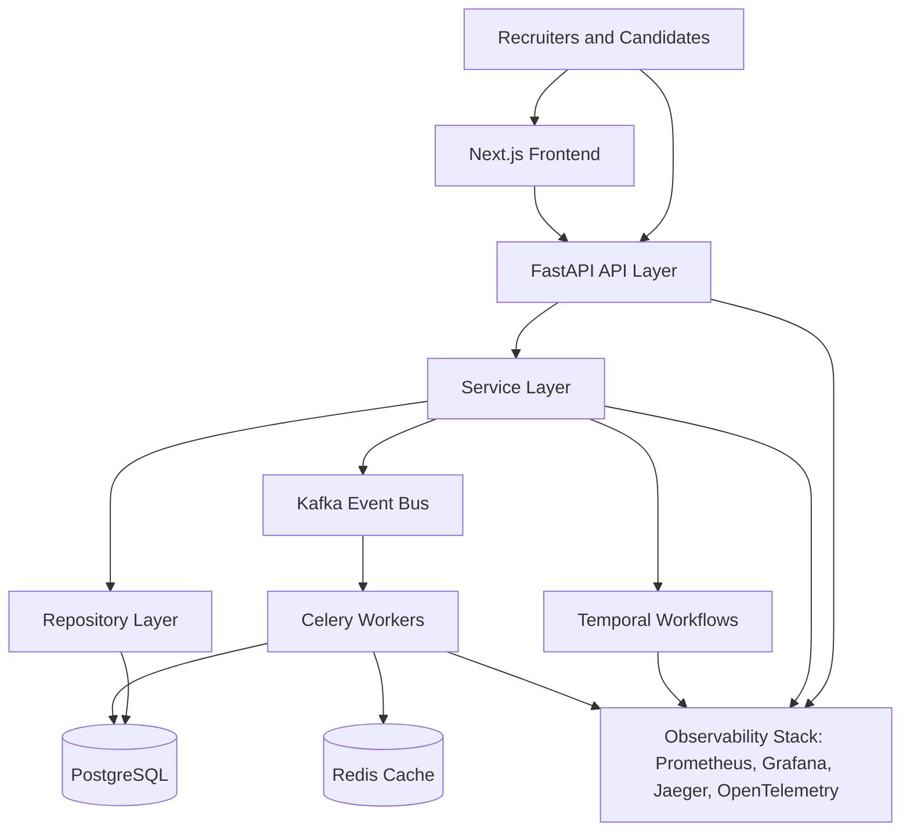
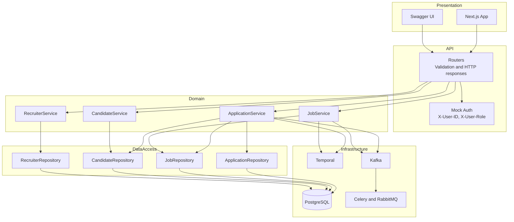
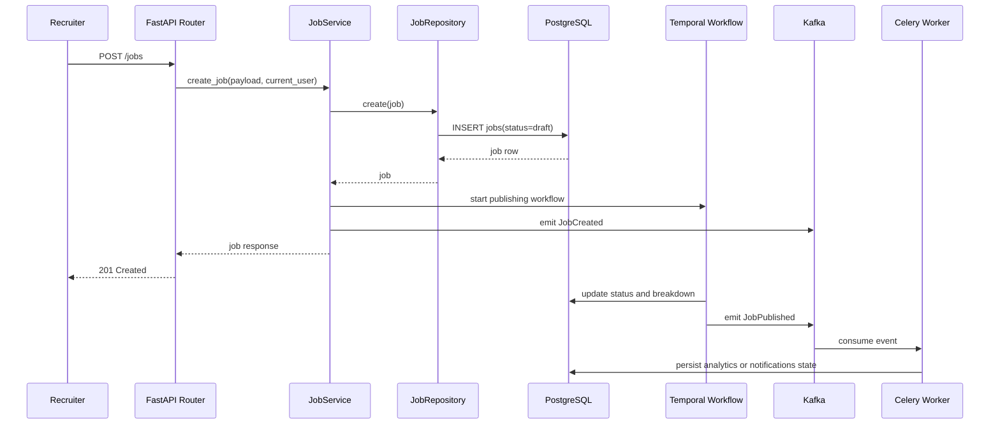
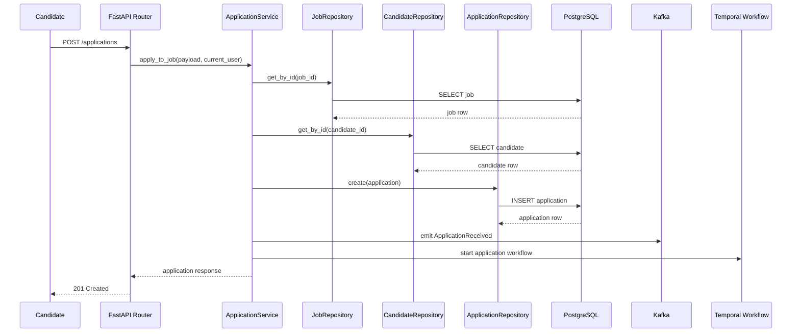
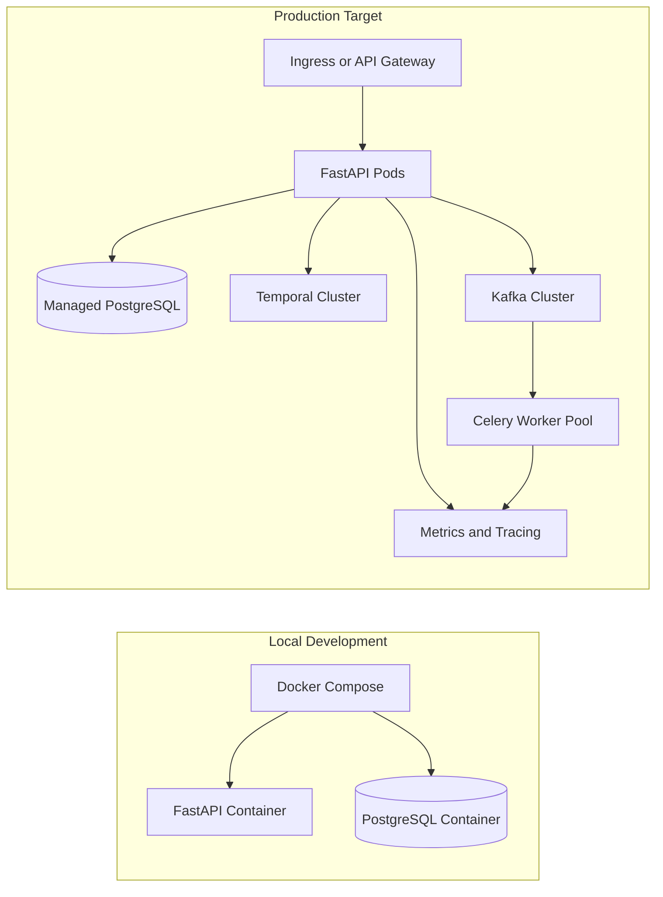

# Architecture: SmartHire System Design

## System Overview

SmartHire is built as an async-first, event-driven platform with clear layer boundaries between HTTP handling, business logic, persistence, and asynchronous processing.

## System Context

## Layered Application Design

## Core Components

### API Layer

- Location: `backend/app/api/`
- Responsibility: request parsing, schema validation, dependency injection, response formatting
- Style: fully async FastAPI handlers

### Services Layer

- Location: `backend/app/services/`
- Responsibility: business rules, orchestration, workflow triggers, event emission
- Principle: services own behavior, repositories own queries

### Repository Layer

- Location: `backend/app/repositories/`
- Responsibility: CRUD and query composition with SQLAlchemy 2.0 async APIs

### Persistence Layer

- Primary store: PostgreSQL
- Flexible fields: JSONB for resume data, parsed job content, and application metadata
- Schema control: Alembic migrations committed to git

### Async Processing

- Temporal: stateful workflows such as job publishing and application progression
- Kafka: domain events such as `JobPublished` and `ApplicationReceived`
- Celery: isolated, stateless background work such as notifications and analytics updates

## Job Publishing Flow

## Candidate Application Flow

## Deployment View

## Design Principles

1. Async first across API, database access, and workflow integration.
2. Separation of concerns between routers, services, repositories, and infrastructure clients.
3. Strong relational integrity for core entities, with JSONB only where schema flexibility is useful.
4. Event-driven side effects so slow or bursty work stays off the request path.
5. Observability across request handling, workflow execution, and background workers.

## Related Documentation

- [Database Design](DATABASE.md)
- [Service Layer](SERVICES.md)
- [Setup Guide](SETUP.md)
