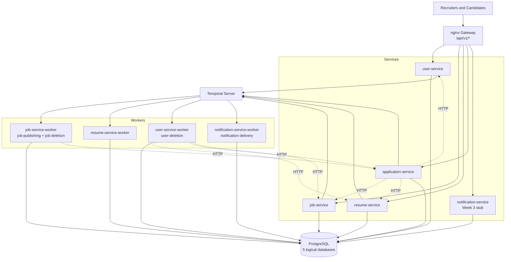
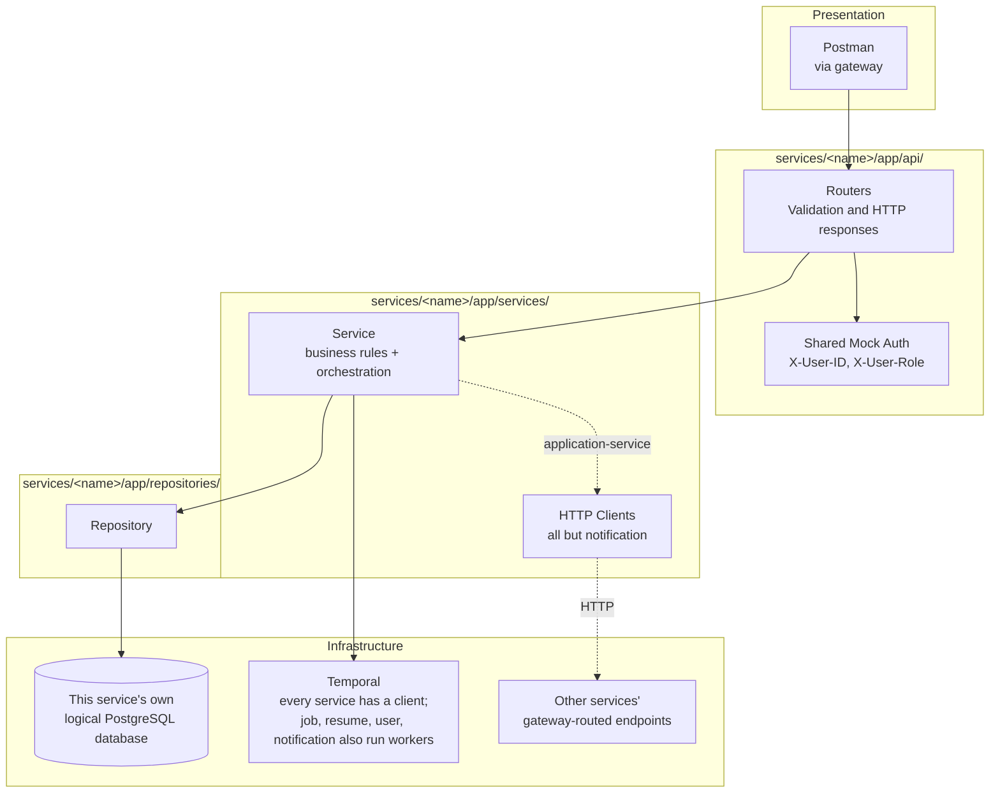
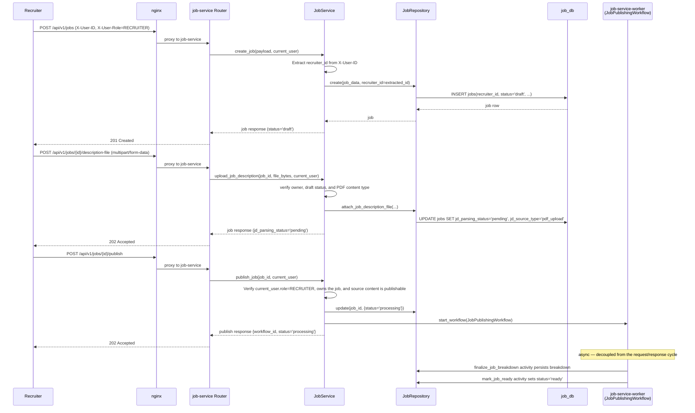
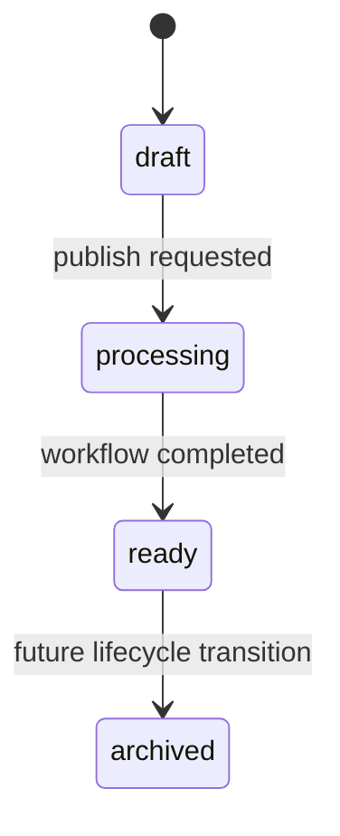
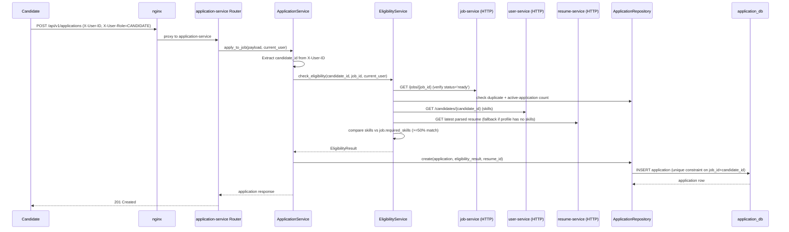
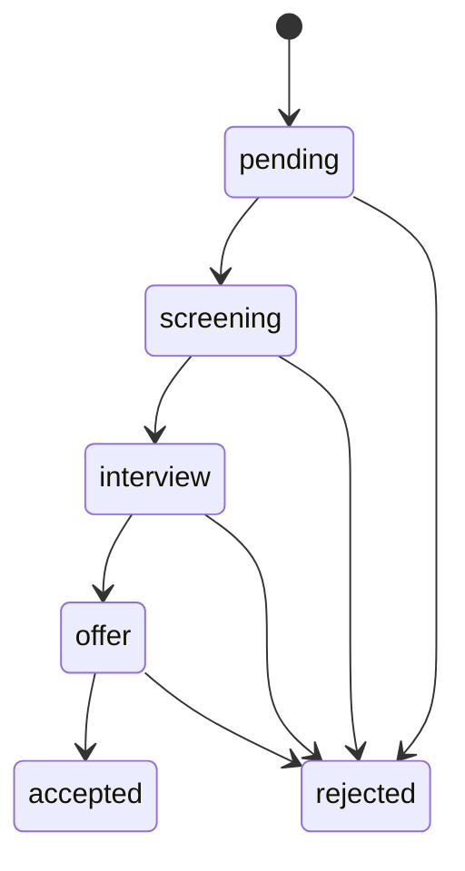
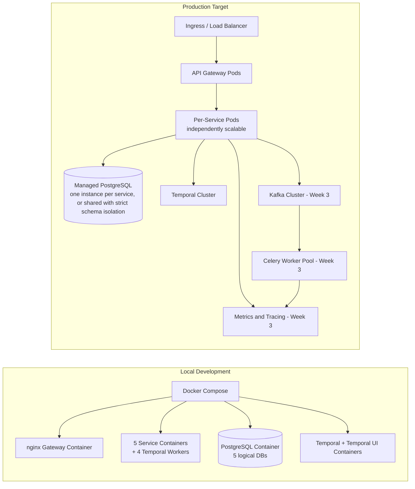

# Architecture: SmartHire System Design

## System Overview

SmartHire is a microservices platform: five independent async-first FastAPI services, each with its own PostgreSQL database, sitting behind a single nginx API gateway. Clear layer boundaries (HTTP handling → business logic → persistence) are enforced _within_ each service; boundaries _between_ services are enforced over HTTP, never by sharing a database or ORM session. New human-identity types (recruiters, candidates, and future types such as Admin or Employer) are added inside the consolidated **user-service** as additional tables/routers/services — not as new microservices.

## System Context

`application-service` connects to Temporal as a **client only** — it starts `NotificationDeliveryWorkflow` by name on notification-service's task queue and hosts no workflows itself.

`user-service-worker` reaches job-service two ways: an activity lists a recruiter's jobs over HTTP, then the workflow spawns child `JobDeletionWorkflow` executions directly onto job-service's `job-deletion` task queue. The task queue is a deliberate second integration surface alongside HTTP — the workflow name and queue live in `contracts/temporal.py` so the dependency is declared rather than re-typed as string literals.

Kafka, Celery/RabbitMQ, Redis, and the Prometheus/Grafana/Jaeger/OpenTelemetry observability stack are Part A's Week 3 scope (event-driven processing + observability) and are **not yet implemented**. See [PRD](PRD.md) for the full timeline.

## Layered Application Design (per service)

Every service repeats this same internal shape. The only structural difference between services is which of the optional pieces they use: `job/`, `resume/`, `user/`, and `notification/` add a full `app/temporal/` package (workflows, activities, worker entrypoint); `application/` has an `app/temporal/` with a client and DTOs but no worker, since it only *starts* workflows others own; `user/`, `job/`, and `application/` all use `app/clients/` for cross-service HTTP instead of any shared repository access.

## Core Components

### API Layer

- Location: `services/<name>/app/api/`
- Responsibility: request parsing, schema validation, dependency injection, response formatting
- Style: fully async FastAPI handlers
- Error handling: catches domain exceptions from services and converts to HTTP responses via centralized exception handlers
- **Auth scoping:** Guards endpoints with `require_role()` dependency; only authenticated users of the correct role can proceed
- **Gateway:** nginx (`infra/nginx/nginx.conf`) is the intended API entrypoint for real traffic, routing `/api/v1/<resource>/*` to the owning service's internal port. Each service additionally publishes its own host port (8001, 8003-8006) as a local-dev convenience for direct Swagger access — not something a real client should call.

### Services Layer

- Location: `services/<name>/app/services/`
- Responsibility: business rules, orchestration, workflow triggers
- Principle: services own behavior, repositories own queries
- **Exception pattern:** Services raise domain exceptions (`NotFoundError`, `ForbiddenError`, `BadRequestError`, `ConflictError`, `PayloadTooLargeError`, `ServiceUnavailableError`) from the shared `exceptions.http_exceptions` module, **not** `HTTPException`. This decouples services from HTTP and allows them to be called from workflows, background tasks, or other contexts.
- **Auth binding:** Services extract ownership IDs from `current_user` context (X-User-ID header), not from request bodies. Prevents authorization bypasses.
- **Cross-service calls:** no service has direct DB access to another service's tables — cross-service reads/writes go over HTTP via each service's own `app/clients/`, never a join across databases. application-service calls job-service, user-service, and resume-service (to validate jobs/candidates and cascade-delete on job/candidate removal); job-service calls user-service and application-service; user-service calls resume-service and application-service (to cascade-delete a candidate's resumes/applications on candidate deletion); resume-service calls user-service. Only `notification-service` makes no outbound service calls.

### Repository Layer

- Location: `services/<name>/app/repositories/`
- Responsibility: CRUD and query composition with SQLAlchemy 2.0 async APIs
- **Database-level pagination:** List methods accept `limit` and `offset` parameters and apply them in SQL queries, not Python
- **Database-level filtering:** Status filters, recruiter filters, etc. are applied in SQL WHERE clauses
- **Service-scoped database:** each service owns one logical Postgres database (see [Database Design](DATABASE.md)) — there are no cross-service foreign keys

### Persistence Layer

- Primary store: one shared PostgreSQL container, five logical databases — `user_db`, `job_db`, `resume_db`, `application_db`, `notification_db` (`infra/postgres/init.sql`)
- **Flexible fields:** JSONB for candidate master profiles, candidate resume parsing output, parsed job content, and application eligibility results
- **Schema control:** each service has its own Alembic migration history under `services/<name>/migrations/`
- **Transaction management:** Session commit/rollback is handled by each service's `get_db_session()` dependency. Repositories use `flush()` to get IDs without committing; the session commits only after the route handler completes successfully.
- **Resume storage:** Resume files and parsed output live entirely in resume-service's `candidate_resumes` table, independent of any application; internal `storage_path` is stored for internal use only and never exposed in API responses
- **JD storage:** Internal `jd_storage_path` is stored in job-service's database for internal use only; API responses **do not** include this path

### Manual Validation Surface

- The Postman collection (`postman/SmartHire.postman_collection.json`), driven entirely through the nginx gateway, is the primary validation surface.
- Each service exposes its own Swagger UI/ReDoc (`docs_url="/docs"`), reachable directly on its host port (user 8001, job 8003, resume 8004, application 8005, notification 8006) for interactive schema inspection — nginx doesn't proxy `/docs`, so it isn't reachable through the gateway itself.
- Resume files are uploaded independently of any application (`POST /resumes`) and stored on resume-service's local disk in development.
- Job description PDFs are uploaded per job and processed through the Temporal `JobPublishingWorkflow` when the job is published.

### Async Processing

- **Temporal** (implemented). Six workflows across four task queues:

| Workflow | Worker (task queue) | Purpose |
|---|---|---|
| `JobPublishingWorkflow` | job-service-worker (`job-publishing`) | Finalize the description breakdown, mark the job `ready` |
| `JobDeletionWorkflow` | job-service-worker (`job-deletion`) | Applications → JD file → job row |
| `ResumeParsingWorkflow` | resume-service-worker (`resume-parsing`) | Convert an uploaded resume to markdown, extract structured data |
| `CandidateDeletionWorkflow` | user-service-worker (`user-deletion`) | Resumes ∥ applications, then the candidate row |
| `RecruiterDeletionWorkflow` | user-service-worker (`user-deletion`) | Fan out child `JobDeletionWorkflow` per job, then the recruiter row |
| `NotificationDeliveryWorkflow` | notification-service-worker (`notification-delivery`) | Record the notification, then retry delivery for up to 24h |

  The publishing and parsing workflows use bounded retries (3 and 5 attempts). The delete cascades and notification delivery use **unbounded** retries capped only by the workflow execution timeout — a downstream service being down is an expected condition, not a failure. job-service-worker serves two task queues from one process via `asyncio.gather` over two `Worker` instances.

- **Kafka, Celery** (Week 3, not yet implemented): planned for domain events (`JobPublished`, `ApplicationReceived`) and isolated background work (analytics, scoring). A transactional outbox belongs with that work — today the delete endpoints and the notification trigger both commit and *then* start a workflow, a dual-write gap where a crash in between strands the record.

## Job Publishing Flow

**Key points:**

- `recruiter_id` is bound to `X-User-ID` on creation; clients cannot override it
- `status` defaults to `draft` and cannot be set in the create request
- JD ingestion is a separate upload operation that tracks parsing state independently from publication state
- Publishing is a separate `POST /jobs/{id}/publish` operation with authorization scoping; the actual breakdown work happens asynchronously in job-service-worker, not on the request thread
- The publish workflow persists normalized metadata into top-level job fields and a richer `description_breakdown` JSONB payload

## Application Submission Flow

**Key points:**

- `candidate_id` is bound to `X-User-ID`; clients cannot override it
- Job must be in `ready` status; applications to draft/processing/archived jobs are rejected
- Unique constraint `(job_id, candidate_id)` prevents duplicates at DB level
- Duplicate applications return `409 Conflict`
- Resume upload (`POST /resumes`, handled entirely by resume-service) is independent of application submission — a candidate can upload one before ever applying, and it's only linked by `resume_id` if the eligibility check needed to fall back to it

## Deployment View

## Design Principles

1. Async first across API, database access, and workflow integration.
2. Separation of concerns between routers, services, repositories, and infrastructure clients — enforced _within_ each service.
3. Separation of concerns _between_ services via HTTP only — no shared database, no cross-service ORM joins, no shared session.
4. Separate JD content-ingestion state from recruiter-visible publication state so future workflows can evolve independently.
5. Strong relational integrity within a service's own database, with JSONB only where schema flexibility is useful; cross-service references are validated at write-time via HTTP, not DB constraints.
6. Event-driven side effects (Week 3) so slow or bursty work stays off the request path.
7. Observability (Week 3) across request handling, workflow execution, and background workers.

## Related Documentation

- [Database Design](DATABASE.md)
- [Service Layer](SERVICES.md)
- [Setup Guide](SETUP.md)
