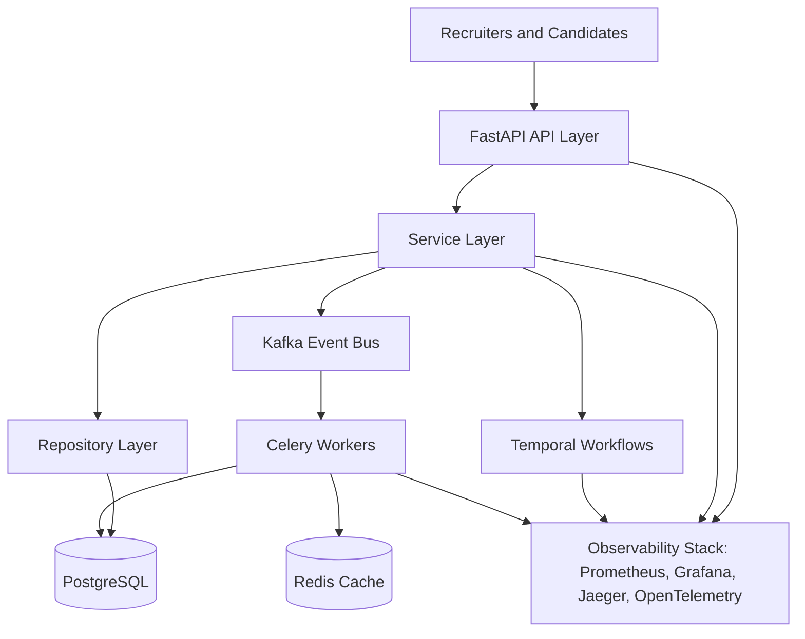
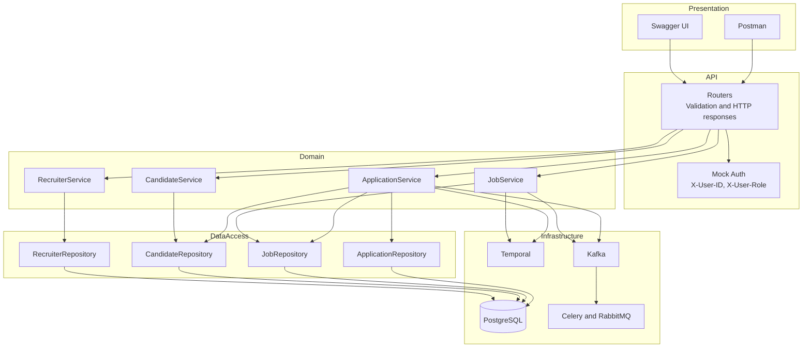
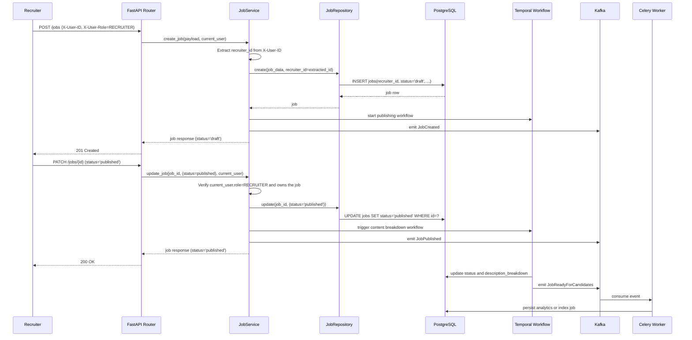
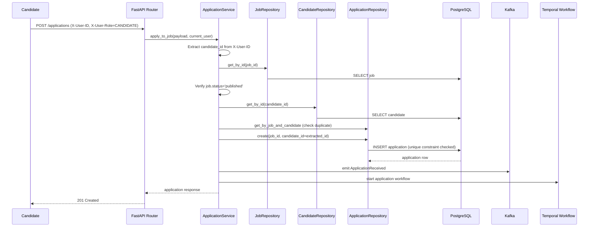
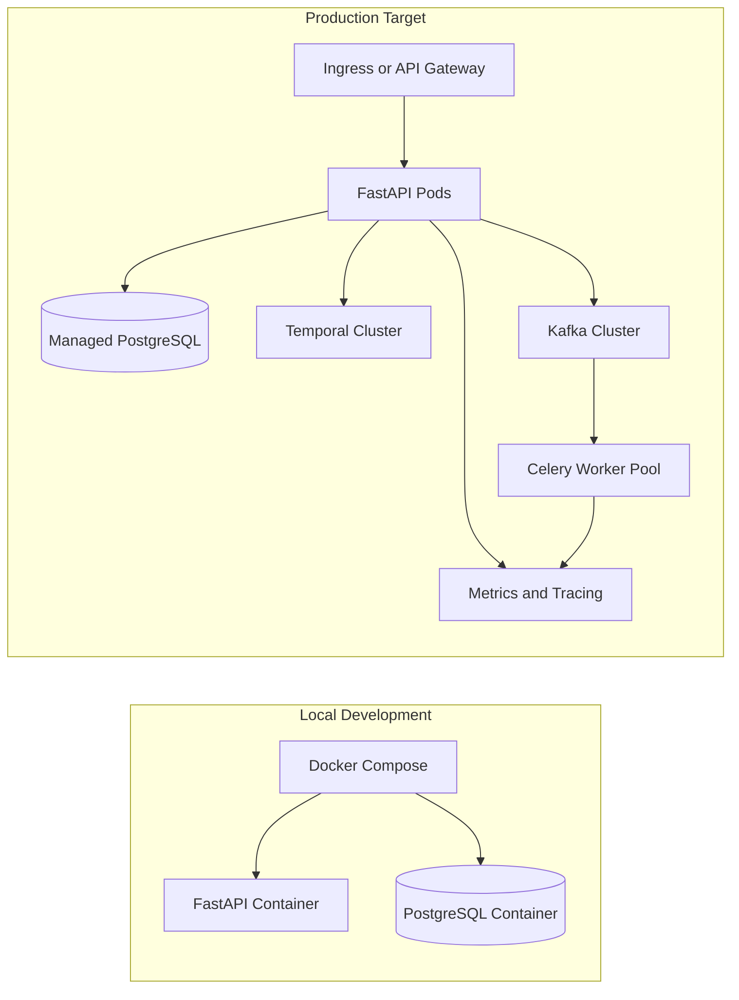

# Architecture: SmartHire System Design

## System Overview

SmartHire is built as an async-first, event-driven platform with clear layer boundaries between HTTP handling, business logic, persistence, and asynchronous processing.

## System Context

## Layered Application Design

## Core Components

### API Layer

- Location: `backend/app/api/`
- Responsibility: request parsing, schema validation, dependency injection, response formatting
- Style: fully async FastAPI handlers
- Error handling: catches domain exceptions from services and converts to HTTP responses via centralized exception handlers
- **Auth scoping:** Guards endpoints with `require_role()` dependency; only authenticated users of the correct role can proceed

### Services Layer

- Location: `backend/app/services/`
- Responsibility: business rules, orchestration, workflow triggers, event emission
- Principle: services own behavior, repositories own queries
- **Exception pattern:** Services raise domain exceptions (`NotFoundError`, `ForbiddenError`, `BadRequestError`, `ConflictError`, `PayloadTooLargeError`), **not** `HTTPException`. This decouples services from HTTP and allows them to be called from workflows, background tasks, or other contexts.
- **Auth binding:** Services extract ownership IDs from `current_user` context (X-User-ID header), not from request bodies. Prevents authorization bypasses.

### Repository Layer

- Location: `backend/app/repositories/`
- Responsibility: CRUD and query composition with SQLAlchemy 2.0 async APIs
- **Database-level pagination:** List methods accept `limit` and `offset` parameters and apply them in SQL queries, not Python
- **Database-level filtering:** Status filters, recruiter filters, etc. are applied in SQL WHERE clauses

### Persistence Layer

- Primary store: PostgreSQL
- **Flexible fields:** JSONB for application resume data, parsed job content, and application metadata
- **Schema control:** Alembic migrations committed to git
- **Transaction management:** Session commit/rollback is handled by the `get_db_session()` dependency. Repositories use `flush()` to get IDs without committing; the session commits only after the route handler completes successfully.
- **Resume storage:** Internal `resume_storage_path` is stored in the database for internal use only; API responses **do not** include this path (security best practice)

### Manual Validation Surface

- Swagger UI and Postman are the primary clients for the current backend-only scope.
- Resume files are uploaded per application and stored locally in development.

### Async Processing

- Temporal: stateful workflows such as job publishing and application progression
- Kafka: domain events such as `JobPublished` and `ApplicationReceived`
- Celery: isolated, stateless background work such as notifications and analytics updates

## Job Publishing Flow

**Key points:**

- `recruiter_id` is bound to `X-User-ID` on creation; clients cannot override it
- `status` defaults to `draft` and cannot be set in the create request
- Publishing is a separate `PATCH` operation with authorization scoping
- Workflow and event emissions happen after persistence

## Candidate Application Flow

**Key points:**

- `candidate_id` is bound to `X-User-ID`; clients cannot override it
- Job must be in `published` status; applications to draft/closed jobs are rejected
- Unique constraint `(job_id, candidate_id)` prevents duplicates at DB level
- Duplicate applications return `409 Conflict`

## Deployment View

## Design Principles

1. Async first across API, database access, and workflow integration.
2. Separation of concerns between routers, services, repositories, and infrastructure clients.
3. Strong relational integrity for core entities, with JSONB only where schema flexibility is useful.
4. Event-driven side effects so slow or bursty work stays off the request path.
5. Observability across request handling, workflow execution, and background workers.

## Related Documentation

- [Database Design](DATABASE.md)
- [Service Layer](SERVICES.md)
- [Setup Guide](SETUP.md)
