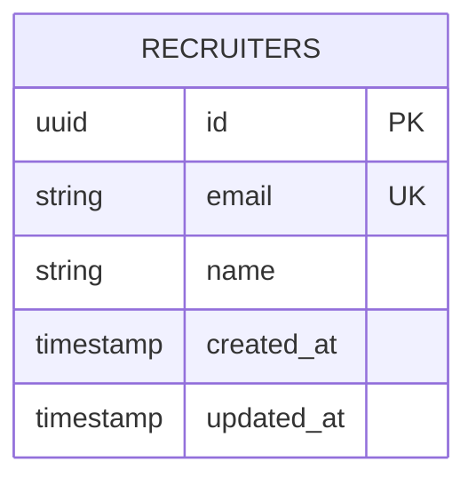
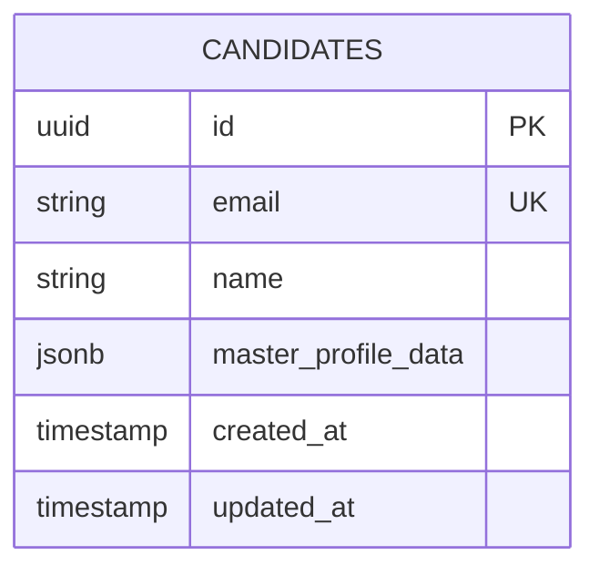
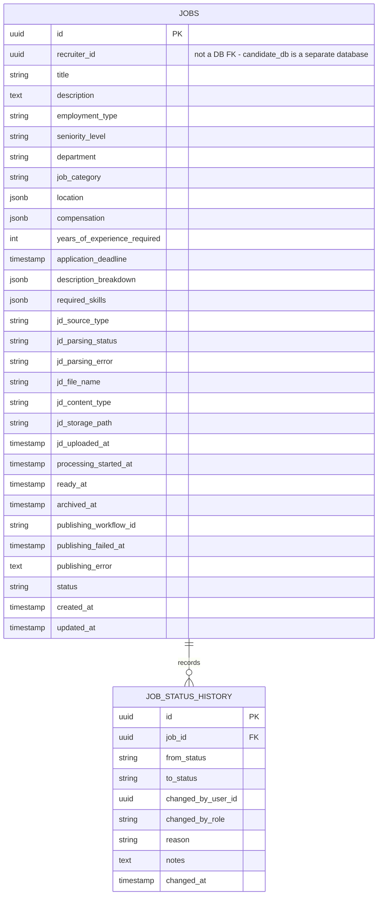
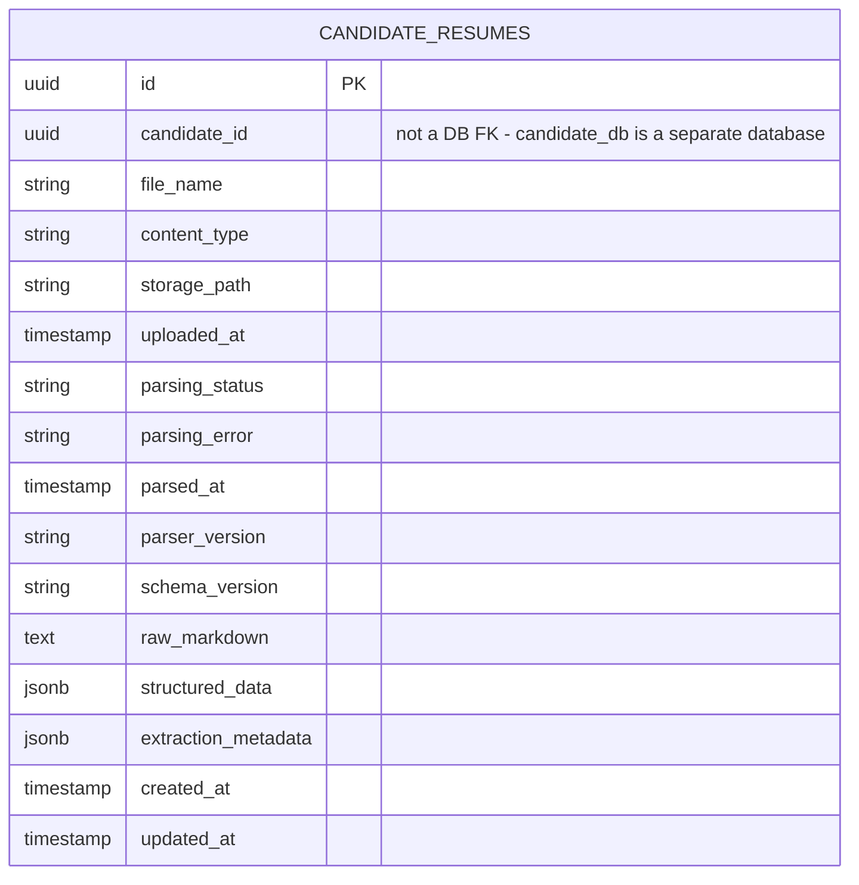
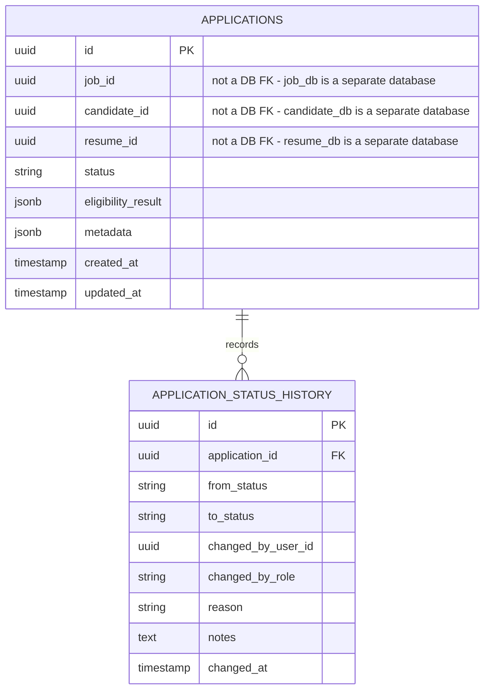
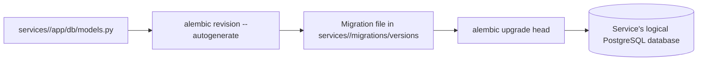

# Database: Schema, Migrations, and Design

## Overview

SmartHire runs one PostgreSQL container hosting **six independent logical databases** — one per service (`infra/postgres/init.sql`). Each service uses SQLAlchemy 2.0 async models and its own Alembic migration history under `services/<name>/migrations/`. There are **no cross-database foreign keys**: a table can only reference another table in the *same* database. Cross-service references (an application's `job_id`, `candidate_id`, `resume_id`) are plain indexed UUID columns, validated at write-time by the owning service calling the other service over HTTP — not by a DB constraint.

| Database           | Owning Service        |
| -------------------- | ------------------------ |
| `recruiter_db`      | recruiter-service       |
| `candidate_db`      | candidate-service       |
| `job_db`            | job-service             |
| `resume_db`         | resume-service          |
| `application_db`    | application-service     |
| `notification_db`   | notification-service (no tables yet — Week 3 stub) |

## Entity Relationship Diagrams

Each diagram below is scoped to a single logical database. Relationships that cross database boundaries (e.g. `applications.job_id` → `jobs.id`) are called out separately since they are not real foreign keys.

### `recruiter_db`



### `candidate_db`



### `job_db`



### `resume_db`



Resumes are owned entirely by the candidate — they are uploaded independently via `POST /resumes` and are **not** linked to any single application. There is no `source_application_id` column; an application only stores a `resume_id` reference to whichever resume it was evaluated against.

### `application_db`



## Migration Lifecycle



Each service's `Dockerfile` runs `alembic upgrade head` automatically before starting `uvicorn`, so a fresh `docker compose up --build` applies every service's migrations without a manual step.

## Tables

### recruiters (`recruiter_db`)

- Purpose: recruiters who create jobs and review applications.
- Key constraints: unique email, UUID primary key.
- Ownership: recruiter-service is the sole owner and writer of this table.

### candidates (`candidate_db`)

- Purpose: job seekers and their identity/profile data.
- Key constraints: unique email, UUID primary key.
- CRUD behavior: candidates can update and delete only their own profiles through the API.
- Flexible fields: `master_profile_data` JSONB stores the candidate's canonical aggregate profile with curated keys for `summary`, `skills`, `contact`, `education`, `work_experience`, and `links`.
- Canonical profile rule: this field is the candidate-level source of truth used for matching; it is not the raw output of a single parser run. application-service's `EligibilityService` reads it via an HTTP call to candidate-service (`CandidateClient`), never via a direct DB join.

### jobs / job_status_history (`job_db`)

- Purpose: job postings and publishing state, owned entirely by job-service.
- Key constraints: `recruiter_id` is an indexed UUID (not a DB foreign key — recruiters live in `recruiter_db`).
- Structured metadata: `employment_type`, `seniority_level`, `department`, `job_category`, `location`, `compensation`, `years_of_experience_required`, and `application_deadline` support filtering, analytics, and future AI matching.
- Flexible fields: `description_breakdown` JSONB and `required_skills` JSONB.
- Canonical content: `description` stores the canonical markdown job description and may be null until manual content is supplied or PDF parsing finishes.
- JD source metadata:
  - `jd_source_type`: `manual_text` or `pdf_upload`
  - `jd_parsing_status`: `pending`, `processing`, `parsed`, `failed`
  - `jd_file_name` and `jd_content_type`: recruiter-uploaded PDF metadata
  - `jd_storage_path`: **internal only** storage path, not exposed in API responses
  - `jd_uploaded_at`: upload timestamp for the current source file
- Publishing lifecycle metadata: `processing_started_at`, `ready_at`, `archived_at`, `publishing_workflow_id` (the Temporal workflow ID from `POST /jobs/{id}/publish`), `publishing_failed_at`, `publishing_error`.
- Status lifecycle: `draft`, `processing`, `ready`, `archived`.
- `job_status_history` is a same-database, real foreign-key child table recording every status transition.

### description_breakdown contract

`jobs.description_breakdown` remains a JSONB field so the parser can evolve without destructive migrations. The current normalized contract is:

- `overview`: short summary or opening role description when present
- `skills`: normalized skill objects with `name`, `category`, `proficiency`, and optional `years_required`
- `technologies`: normalized technology list used for precision filtering and future ranking
- `education_requirements`: parsed degree level and fields of study when present
- `requirements`: grouped `must_haves` and `nice_to_haves`
- `responsibilities`: normalized bullet list
- `location`: parsed location object with `city`, `state`, `country`, `remote_policy`, and `raw_text`
- `compensation`: parsed salary object with `currency`, optional min/max values, interval, and normalized benefits passthrough
- `benefits`: optional list of benefits/perks when present

### candidate_resumes (`resume_db`)

- Purpose: resume artifacts and extraction results, owned entirely by resume-service and independent of any application.
- Key constraints: `candidate_id` is an indexed UUID (not a DB foreign key — candidates live in `candidate_db`).
- Stored metadata: original filename, MIME type, internal storage path, upload timestamp, parsing state, parser/schema version, and extraction metadata.
- Flexible fields: `structured_data` JSONB stores parsed resume content; `raw_markdown` preserves normalized extracted text for reprocessing.
- Authority rule: this table owns all resume file-level and parsing data. Applications only reference a resume by `resume_id`; they never store resume content themselves.

### applications / application_status_history (`application_db`)

- Purpose: a candidate's application to a job, owned entirely by application-service.
- Key constraints: `job_id`, `candidate_id`, and `resume_id` are indexed UUIDs (not DB foreign keys — those tables live in `job_db`, `candidate_db`, and `resume_db` respectively). Existence and ownership are validated by application-service calling job-service/candidate-service/resume-service over HTTP (`app/clients/`) before a row is written.
- Duplicate protection: unique constraint on `(job_id, candidate_id)`, enforced at the database level within `application_db`.
- Eligibility: `eligibility_result` JSONB stores the outcome of `EligibilityService`'s skills-match check (reason code, match score, missing skills, and the `resume_id` used if the check fell back to a parsed resume).
- Flexible fields: `metadata` JSONB stores workflow state, scores, and notes.
- `application_status_history` is a same-database, real foreign-key child table recording every status transition.

## Constraint Summary

| Table                      | Constraint                          | Reason                                | Scope                    |
| --------------------------- | ------------------------------------ | --------------------------------------- | --------------------------- |
| recruiters                 | unique(email)                       | Prevent duplicate recruiter accounts  | `recruiter_db`            |
| candidates                 | unique(email)                       | Prevent duplicate candidate accounts  | `candidate_db`             |
| job_status_history         | FK to jobs                          | Real DB constraint — same database    | `job_db`                   |
| application_status_history | FK to applications                  | Real DB constraint — same database    | `application_db`           |
| applications               | unique(job_id, candidate_id)        | Prevent duplicate submissions         | `application_db`           |
| applications               | job_id / candidate_id / resume_id validity | HTTP validation against job-service / candidate-service / resume-service, **not** a DB constraint | application-service logic |

## Cascade Behavior

Only same-database foreign keys have real cascade behavior:

| Foreign Key                                | Delete Rule | Why                                                       |
| -------------------------------------------- | ------------- | ------------------------------------------------------------ |
| job_status_history.job_id                  | CASCADE     | Remove status history when a job is removed               |
| application_status_history.application_id  | CASCADE     | Remove status history when an application is removed       |

Cross-service references (a deleted job's applications, a deleted candidate's resumes) have **no** database-level cascade — each service is responsible for handling stale references from another service defensively (e.g. treating a `404` from `JobClient.get_job()` as "job no longer exists").

## JSONB Usage

Use JSONB for:

- aggregated candidate master profiles
- parsed candidate resume content
- structured job description breakdowns
- application eligibility results and workflow metadata

Do not use JSONB for:

- primary identifiers
- same-service relations
- frequently filtered scalar fields that need dedicated indexes

## Migration Commands

Run from inside a specific service's directory:

```bash
cd services/<name>
alembic upgrade head
alembic current
alembic history --verbose
alembic revision --autogenerate -m "describe schema change"
```

## Related Documentation

- [Architecture](ARCHITECTURE.md)
- [Setup Guide](SETUP.md)
