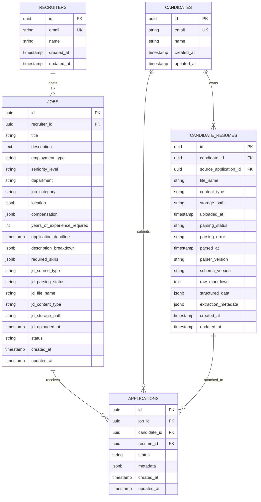
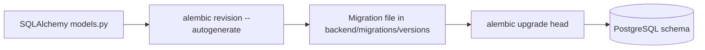

# Database: Schema, Migrations, and Design

## Overview

SmartHire uses PostgreSQL with SQLAlchemy 2.0 async models and Alembic migrations. The schema is designed for strong consistency on core entities while keeping selective JSONB fields for flexible data.

## Entity Relationship Diagram



## Migration Lifecycle



## Tables

### recruiters

- Purpose: recruiters who create jobs and review applications.
- Key constraints: unique email, UUID primary key.
- Relationships: one recruiter can own many jobs and review many applications.

### candidates

- Purpose: job seekers and their identity data.
- Key constraints: unique email, UUID primary key.
- CRUD behavior: candidates can update and delete only their own profiles through the API.
- Scoring basis: application scoring is based solely on resume parsing; each resume is evaluated independently per application.

### candidate_resumes

- Purpose: immutable-ish resume artifacts and extraction results owned by the candidate.
- Key constraints: foreign key to candidates, optional provenance link back to the application that uploaded the file.
- Stored metadata: original filename, MIME type, internal storage path, upload timestamp, parsing state, parser/schema version, and extraction metadata.
- Flexible fields: `structured_data` JSONB stores parsed resume content for one uploaded document; `raw_markdown` preserves normalized extracted text for reprocessing.
- Authority rule: this table owns file-level parsing output. Applications only reference the resume that was submitted for that job.

### jobs

- Purpose: job postings and publishing state.
- Key constraints: recruiter foreign key, indexed recruiter lookup.
- Structured metadata: `employment_type`, `seniority_level`, `department`, `job_category`, `location`, `compensation`, `years_of_experience_required`, and `application_deadline` support filtering, analytics, and future AI matching.
- Flexible fields: `description_breakdown` JSONB and `required_skills` JSONB.
- Canonical content: `description` now stores the canonical markdown job description and may be null until manual content is supplied or PDF parsing finishes.
- JD source metadata:
  - `jd_source_type`: `manual_text` or `pdf_upload`
    - `jd_parsing_status`: `pending`, `processing`, `parsed`, `failed`
  - `jd_file_name` and `jd_content_type`: recruiter-uploaded PDF metadata
  - `jd_storage_path`: **internal only** storage path, not exposed in API responses
  - `jd_uploaded_at`: upload timestamp for the current source file
- Status lifecycle: `draft`, `processing`, `ready`, `archived`.

### description_breakdown contract

`jobs.description_breakdown` remains a JSONB field so the parser can evolve without destructive migrations. The current normalized contract is:

- `overview`: short summary or opening role description when present
- `skills`: normalized skill objects with `name`, `category`, `proficiency`, and optional `years_required`
- `technologies`: normalized technology list used for precision filtering and future ranking
- `education_requirements`: parsed degree level and fields of study when present
- `requirements`: grouped `must_haves` and `nice_to_haves`
- `responsibilities`: normalized bullet list
- `location`: parsed location object with `city`, `state`, `country`, `remote_policy`, and `raw_text`
- `compensation`: parsed salary object with `currency`, optional min/max values, interval, and normalized benefits passthrough
- `benefits`: optional list of benefits/perks when present

### applications

- Purpose: a candidate’s application to a job.
- Key constraints: foreign keys to jobs and candidates.
- Duplicate protection: unique constraint on `(job_id, candidate_id)`.
- Ownership path: recruiter visibility is derived through `applications.job_id -> jobs.recruiter_id`; no duplicate recruiter foreign key is stored on the application row.
- Resume reference: `resume_id` points to the specific candidate-owned resume snapshot used for this application.
- Flexible fields: `metadata` JSONB stores workflow state, scores, notes, and per-application AI outputs only.

## Constraint Summary

| Table             | Constraint                          | Reason                               |
| ----------------- | ----------------------------------- | ------------------------------------ |
| recruiters        | unique(email)                       | Prevent duplicate recruiter accounts |
| candidates        | unique(email)                       | Prevent duplicate candidate accounts |
| candidate_resumes | foreign key to candidates           | Enforce resume ownership             |
| jobs              | foreign key to recruiters           | Enforce job ownership                |
| applications      | foreign keys to jobs and candidates | Enforce valid applications           |
| applications      | unique(job_id, candidate_id)        | Prevent duplicate submissions        |

## Cascade Behavior

| Foreign Key                             | Delete Rule | Why                                                                     |
| --------------------------------------- | ----------- | ----------------------------------------------------------------------- |
| candidate_resumes.candidate_id          | CASCADE     | Remove resume snapshots when a candidate is removed                     |
| candidate_resumes.source_application_id | SET NULL    | Keep candidate resume history even if the source application is removed |
| jobs.recruiter_id                       | RESTRICT    | Do not delete recruiters with owned jobs                                |
| applications.job_id                     | CASCADE     | Remove applications when a job is removed                               |
| applications.candidate_id               | CASCADE     | Remove applications when a candidate is removed                         |
| applications.resume_id                  | SET NULL    | Preserve the application even if a resume snapshot is deleted           |

Deleting a candidate triggers database-level cascading removal of that candidate's applications.

## JSONB Usage

Use JSONB for:

- aggregated candidate master profiles
- parsed candidate resume content
- structured job description breakdowns
- application scoring metadata and notes

Do not use JSONB for:

- primary identifiers
- core relations
- frequently filtered scalar fields that need dedicated indexes

## Migration Commands

```bash
cd backend
alembic upgrade head
alembic current
alembic history --verbose
alembic revision --autogenerate -m "describe schema change"
```

## Related Documentation

- [Architecture](ARCHITECTURE.md)
- [Setup Guide](SETUP.md)
