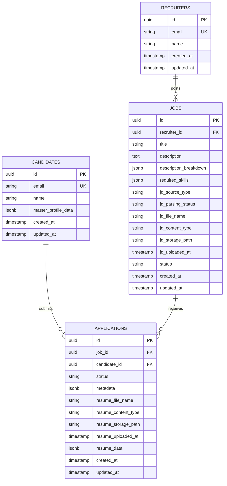
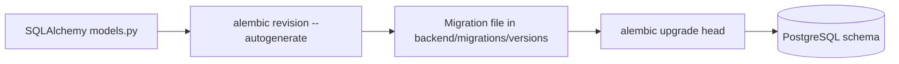

# Database: Schema, Migrations, and Design

## Overview

SmartHire uses PostgreSQL with SQLAlchemy 2.0 async models and Alembic migrations. The schema is designed for strong consistency on core entities while keeping selective JSONB fields for flexible data.

## Entity Relationship Diagram



## Migration Lifecycle



## Tables

### recruiters

- Purpose: recruiters who create jobs and review applications.
- Key constraints: unique email, UUID primary key.
- Relationships: one recruiter can own many jobs and review many applications.

### candidates

- Purpose: job seekers and their identity/profile data.
- Key constraints: unique email, UUID primary key.
- CRUD behavior: candidates can update and delete only their own profiles through the API.
- Flexible fields: `master_profile_data` JSONB stores the candidate's structured aggregate profile with canonical keys for `summary`, `skills`, `contact`, `education`, `work_experience`, and `links`.
- Resume ownership: resumes are attached to applications, not directly to candidate profiles.

### jobs

- Purpose: job postings and publishing state.
- Key constraints: recruiter foreign key, indexed recruiter lookup.
- Flexible fields: `description_breakdown` JSONB and `required_skills` JSONB.
- Canonical content: `description` now stores the canonical markdown job description and may be null until manual content is supplied or PDF parsing finishes.
- JD source metadata:
  - `jd_source_type`: `manual_text` or `pdf_upload`
  - `jd_parsing_status`: `not_started`, `uploaded`, `queued`, `processing`, `parsed`, `failed`
  - `jd_file_name` and `jd_content_type`: recruiter-uploaded PDF metadata
  - `jd_storage_path`: **internal only** storage path, not exposed in API responses
  - `jd_uploaded_at`: upload timestamp for the current source file
- Status lifecycle: `draft`, `publishing`, `published`, `closed`.

### description_breakdown contract

`jobs.description_breakdown` remains a JSONB field so the parser can evolve without destructive migrations. The expected contract for the upcoming parser pipeline is:

- `source`: metadata about the upstream JD file or manual content
- `sections`: normalized markdown sections such as overview, responsibilities, required skills, preferred skills, education, experience, compensation, and location when present
- `extracted_skills`: normalized skill tokens that can seed `required_skills`
- `parser_metadata`: parser version, timestamps, and diagnostics

### applications

- Purpose: a candidate’s application to a job.
- Key constraints: foreign keys to jobs and candidates.
- Duplicate protection: unique constraint on `(job_id, candidate_id)`.
- Ownership path: recruiter visibility is derived through `applications.job_id -> jobs.recruiter_id`; no duplicate recruiter foreign key is stored on the application row.
- Resume fields:
  - `resume_file_name`: Original filename from upload
  - `resume_content_type`: MIME type (application/pdf, application/msword, etc.)
  - `resume_storage_path`: **Internal only** — local filesystem path, **not** exposed in API responses
  - `resume_uploaded_at`: Timestamp of upload
  - `resume_data`: Placeholder for future parsed resume content (currently null)
- Flexible fields: `metadata` JSONB for scores, notes, workflow outputs, and `resume_data` JSONB for parsed resume content.

## Constraint Summary

| Table        | Constraint                          | Reason                               |
| ------------ | ----------------------------------- | ------------------------------------ |
| recruiters   | unique(email)                       | Prevent duplicate recruiter accounts |
| candidates   | unique(email)                       | Prevent duplicate candidate accounts |
| jobs         | foreign key to recruiters           | Enforce job ownership                |
| applications | foreign keys to jobs and candidates | Enforce valid applications           |
| applications | unique(job_id, candidate_id)        | Prevent duplicate submissions        |

## Cascade Behavior

| Foreign Key               | Delete Rule | Why                                             |
| ------------------------- | ----------- | ----------------------------------------------- |
| jobs.recruiter_id         | RESTRICT    | Do not delete recruiters with owned jobs        |
| applications.job_id       | CASCADE     | Remove applications when a job is removed       |
| applications.candidate_id | CASCADE     | Remove applications when a candidate is removed |

Deleting a candidate triggers database-level cascading removal of that candidate's applications.

## JSONB Usage

Use JSONB for:

- aggregated candidate master profiles
- parsed application resume content
- structured job description breakdowns
- application scoring metadata and notes

Do not use JSONB for:

- primary identifiers
- core relations
- frequently filtered scalar fields that need dedicated indexes

## Migration Commands

```bash
cd backend
alembic upgrade head
alembic current
alembic history --verbose
alembic revision --autogenerate -m "describe schema change"
```

## Related Documentation

- [Architecture](ARCHITECTURE.md)
- [Setup Guide](SETUP.md)
