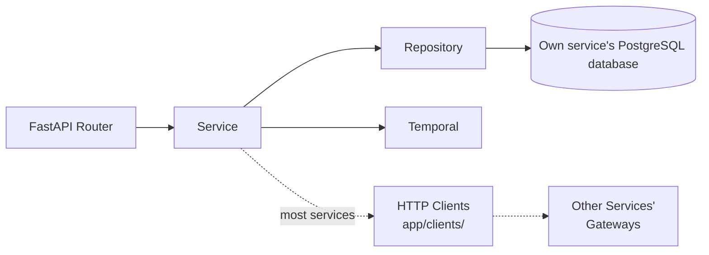
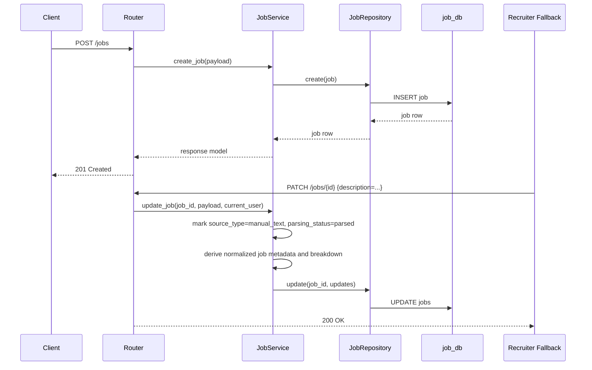
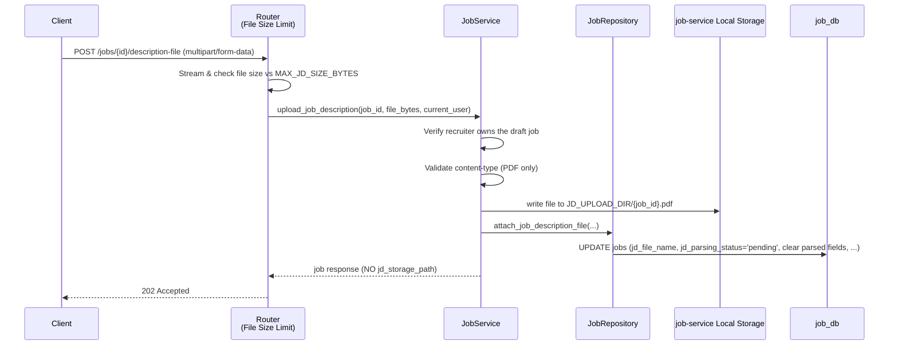
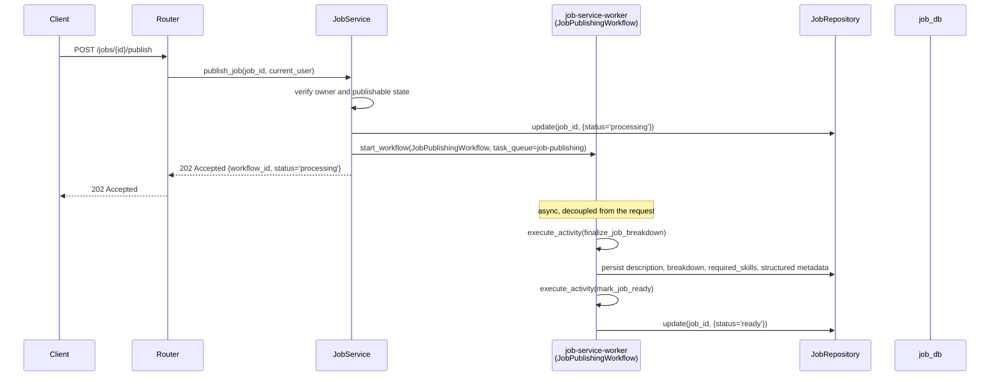
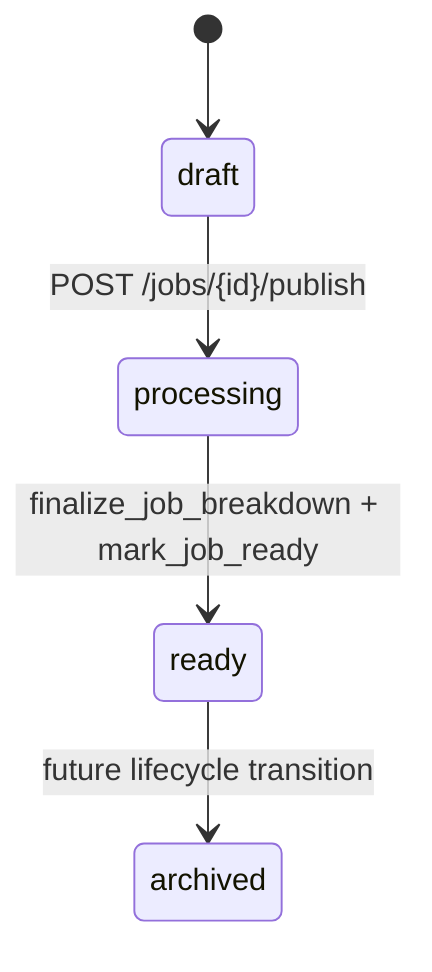
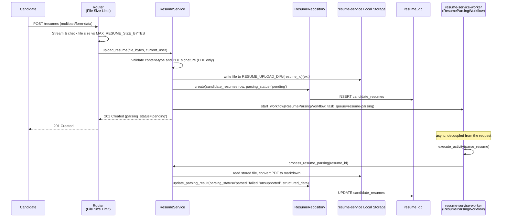
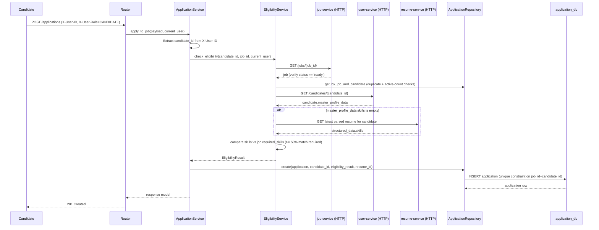
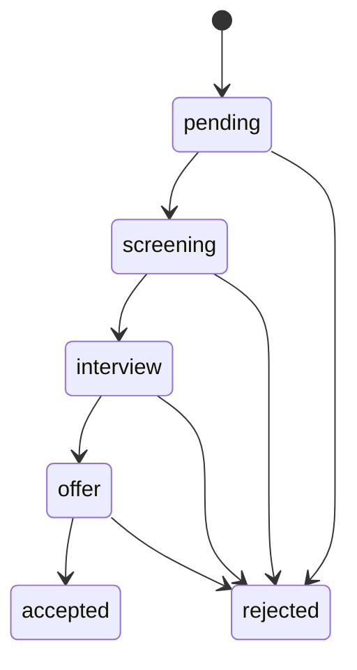

# Services: Business Logic Layer

## Overview

Services own business behavior. Routers should stay thin, repositories should stay data-focused, and services should coordinate validation, persistence, workflows, and — where a service needs data it doesn't own — calls to other services over HTTP. Each service in `services/<name>/` only ever talks to its own database; there is no shared database session or cross-service ORM join anywhere in the codebase.

## Service Interaction Diagram



No service has a local view of another service's tables. Cross-service reads/writes go over HTTP via each service's own `app/clients/`, forwarding the caller's `X-User-ID`/`X-User-Role` headers, instead of joining across databases:

- **application-service** calls job-service, user-service, and resume-service — it has no local view of jobs, candidates, or resumes at all.
- **job-service** calls user-service (to validate the recruiter on job creation) and application-service (to cascade-delete applications when a job is deleted).
- **user-service** calls resume-service and application-service (to cascade-delete a candidate's resumes/applications on candidate deletion).
- **resume-service** calls user-service (to validate the candidate on resume upload).
- **notification-service** makes no outbound service calls.

## Core Service Responsibilities

RecruiterService and CandidateService both live inside the consolidated **user-service**, each owning its own table (`recruiters`, `candidates`), router, and service class. New user types (e.g. Admin, Employer) are added the same way — a new table + router + service inside user-service — never as a new microservice.

### RecruiterService (user-service)

- Create and fetch recruiter profiles.
- Enforce unique recruiter identity rules before persistence.

### CandidateService (user-service)

- Create and fetch candidate records.
- Update and delete the authenticated candidate's own profile.
- Prevent duplicate candidate emails during create and update flows.
- Persist `master_profile_data` as the candidate-level aggregate profile with a strict schema: `summary`, `skills`, `contact`, `education`, `work_experience`, and `links`.
- Keep candidate profiles independent from any resume file — resumes are a separate resource owned by resume-service.

### JobService (job-service)

- Create draft jobs (status always `draft`, recruiter_id from auth context)
- Accept manual description content as a fallback while PDF parsing is pending
- Accept optional structured metadata overrides for employment type, seniority, location, compensation, experience, and deadlines
- Upload recruiter-provided JD PDFs and persist parsing lifecycle metadata
- Update jobs (PATCH) and delete jobs, both with owner-only authorization
- Publish jobs (`POST /jobs/{id}/publish`) by starting `JobPublishingWorkflow` on job-service-worker
- Support JD parsing lifecycle and normalize parsed metadata into first-class job columns

### ResumeService (resume-service)

- Accept a resume upload (`POST /resumes`) independent of any application, bound to the authenticated candidate
- Validate file size (`MAX_RESUME_SIZE_BYTES`), content type, and PDF signature (PDF only)
- Persist the file to local disk and create a `candidate_resumes` row with `parsing_status="pending"`
- Start `ResumeParsingWorkflow` on resume-service-worker after persisting (fire-and-forget from the caller's perspective — upload returns immediately)
- `process_resume_parsing()` (invoked by the Temporal activity, not the API) converts the PDF to markdown and extracts a structured profile, updating `parsing_status` to `parsed`/`failed`/`unsupported`

### ApplicationService (application-service)

- Bind application creation to the authenticated candidate (from `X-User-ID` header)
- Delegate all cross-service validation to `EligibilityService` before persisting anything
- Prevent duplicate applications (unique constraint on `job_id`, `candidate_id`) — also caught at the DB level as a fallback via `IntegrityError`
- Create application records with server-set `candidate_id` and the `eligibility_result` returned by `EligibilityService`
- Resolve recruiter access by calling job-service for the job's `recruiter_id` (no local job data to join against)
- Authorize access: candidates see only their own applications, recruiters see applications for jobs they own

### EligibilityService (application-service)

- Calls job-service (`JobClient.get_job`) to confirm the target job exists and is in `ready` status
- Calls application-service's own repository to check for a duplicate application and the candidate's active-application count against `MAX_APPLICATIONS_PER_CANDIDATE`
- Calls user-service (`CandidateClient.get_candidate`) to read `master_profile_data.skills`
- **Resume fallback:** if the candidate's `master_profile_data.skills` is empty, calls resume-service (`ResumeClient.get_latest_parsed_resume`) and extracts skills from the most recently parsed resume instead
- Compares the resolved candidate skills against `jobs.required_skills` and requires at least 50% overlap to be eligible
- Returns a structured `EligibilityResult` (reason code, match score, missing skills, and the `resume_id` used if the resume fallback fired) that is persisted on the created application

## Job Creation Flow



## Job Description Upload Flow



## Job Publishing Workflow





## Resume Upload & Parsing Flow



This resume is independent of any application — a candidate can upload it before ever applying to a job. Applications only store the `resume_id` they were evaluated against.

## Application Submission Flow



**Key points:**

- `candidate_id` comes from auth context (`X-User-ID`), not request body
- No Temporal workflow is involved — this is a single synchronous request that fans out over HTTP
- Job must be `ready`; database unique constraint `(job_id, candidate_id)` is the final backstop against duplicates
- Resume linkage is best-effort: `resume_id` is only set when the candidate's profile lacked `skills` and the eligibility check fell back to a parsed resume



## Service Design Rules

1. **Raise domain exceptions, not HTTP exceptions.** Services should raise `NotFoundError`, `ForbiddenError`, `BadRequestError`, `ConflictError`, `PayloadTooLargeError`, `ServiceUnavailableError` from the shared `exceptions.http_exceptions` module (mounted at `/shared`, imported the same way in every service). Routers and each service's FastAPI exception handlers (in `app/main.py`) convert these to HTTP responses (400/403/404/409/413/503). This decouples services from HTTP and enables them to be called from workflows or other non-HTTP contexts.

2. **Bind ownership to auth context, not request bodies.** When creating jobs, use `current_user.id` (X-User-ID header) as the recruiter; similarly bind candidate applications and resume uploads to the authenticated candidate's UUID. This prevents authorization bypasses.

3. **Enforce server-controlled status transitions.** Job `status` is never accepted from the request body on creation; it always defaults to `draft`. Publishing happens through `POST /jobs/{id}/publish`, and subsequent transitions follow the explicit state machine.

4. **Keep JD parsing lifecycle separate from publication lifecycle.** `jd_parsing_status` tracks content-ingestion progress, while `status` tracks recruiter-facing publication state. Services should not overload one field to represent both concerns.

5. **Validate eligibility before creating an application**, and do it entirely through HTTP calls to the owning services — application-service never queries `job_db`, `user_db`, or `resume_db` directly.

6. **Keep SQL construction in repositories, pagination in the database.** Repositories should compose `.limit()` and `.offset()` into queries, not return all records for Python-level slicing.

7. **Use services for orchestration and business decisions.** Return schema-friendly domain objects or response models. Prefer database constraints for hard integrity rules that are enforceable within a single service's database (unique constraints, same-service foreign keys), and HTTP validation + service logic for anything that crosses a service boundary.

## Error Handling

Services raise domain exceptions from the shared `exceptions.http_exceptions` module:

| Exception                     | HTTP Code | Scenario                                                |
| ----------------------------- | --------- | ------------------------------------------------------- |
| `BadRequestError`             | 400       | Invalid input, missing required fields, wrong status    |
| `ForbiddenError`              | 403       | Authorization denied (wrong role, not resource owner)   |
| `NotFoundError`               | 404       | Resource doesn't exist                                  |
| `ConflictError`               | 409       | Duplicate application, duplicate email                  |
| `InvalidStateTransitionError` | 400       | Illegal job/application status transition               |
| `PayloadTooLargeError`        | 413       | Resume or JD file exceeds max size                      |
| `ServiceUnavailableError`     | 503       | A downstream Temporal or HTTP dependency is unreachable |

**Conversion pattern** (identical in every service's `app/main.py`):

```python
@app.exception_handler(ForbiddenError)
async def handle_forbidden(_: object, exc: ForbiddenError) -> JSONResponse:
    return JSONResponse(status_code=403, content={"detail": str(exc)})
```

## Related Documentation

- [Architecture](ARCHITECTURE.md)
- [Database Design](DATABASE.md)
- [Setup Guide](SETUP.md)
