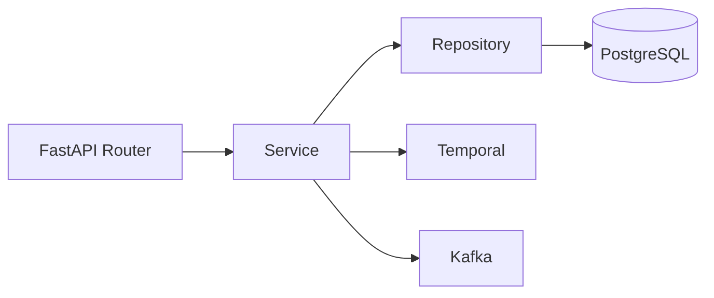
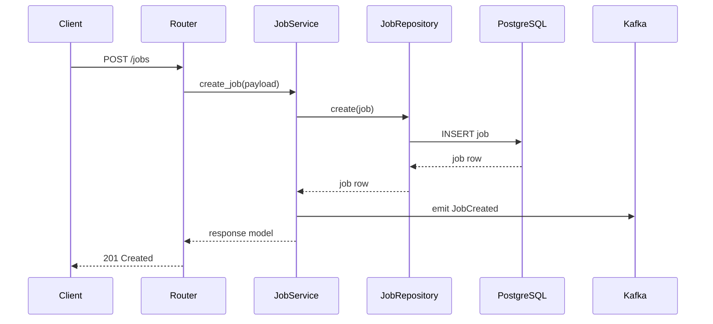
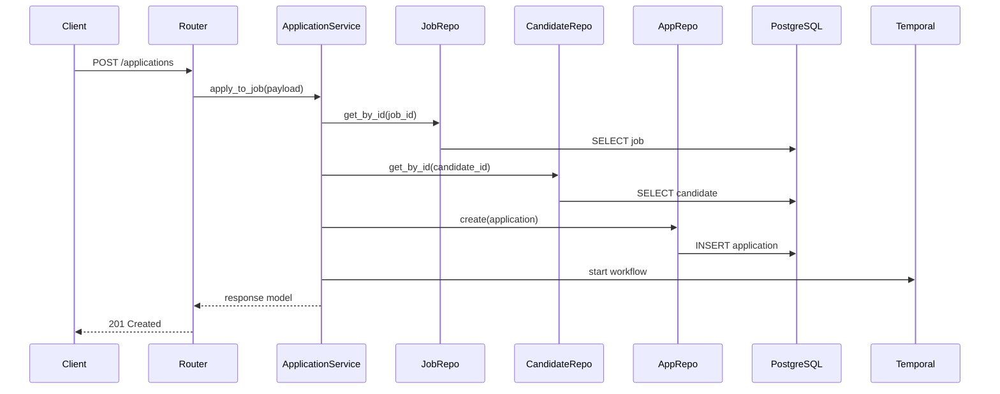
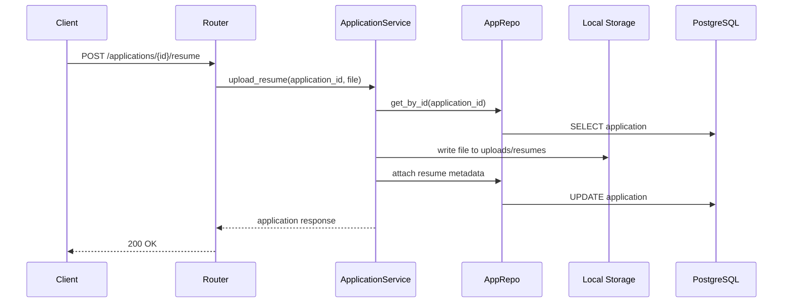

# Services: Business Logic Layer

## Overview

Services own business behavior. Routers should stay thin, repositories should stay data-focused, and services should coordinate validation, persistence, workflows, and events.

## Service Interaction Diagram

## Core Service Responsibilities

### RecruiterService

- Create and fetch recruiter profiles.
- Enforce unique recruiter identity rules before persistence.

### CandidateService

- Create and fetch candidate records.
- Keep candidate profiles independent from application-specific resume variants.

### JobService

- Create draft jobs.
- Start publishing workflows.
- Emit job lifecycle events.
- Enforce recruiter ownership rules.

### ApplicationService

- Validate job and candidate existence.
- Prevent duplicate applications.
- Create application records.
- Attach application-specific resume files and metadata.
- Start downstream scoring or notification workflows.

## Job Creation Flow

## Application Submission Flow

## Resume Upload Flow

## Service Design Rules

1. Keep HTTP-specific concerns in routers.
2. Keep SQL construction in repositories.
3. Use services for orchestration and business decisions.
4. Return schema-friendly domain objects or response models.
5. Prefer database constraints for hard integrity rules and service validation for policy rules.

## Related Documentation

- [Architecture](ARCHITECTURE.md)
- [Database Design](DATABASE.md)
- [Setup Guide](SETUP.md)
