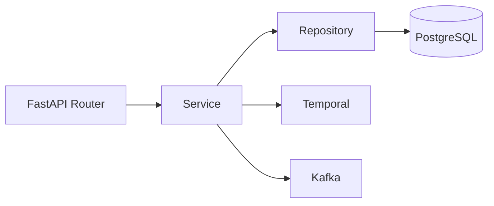
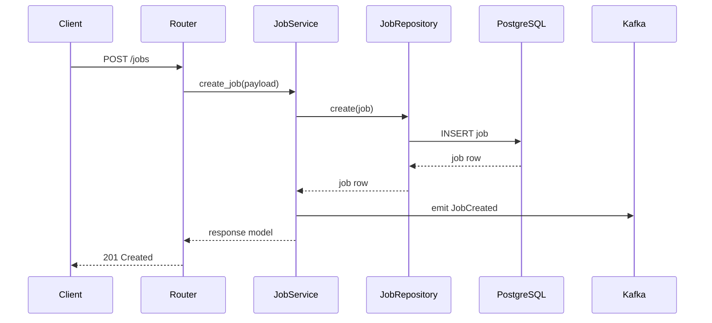
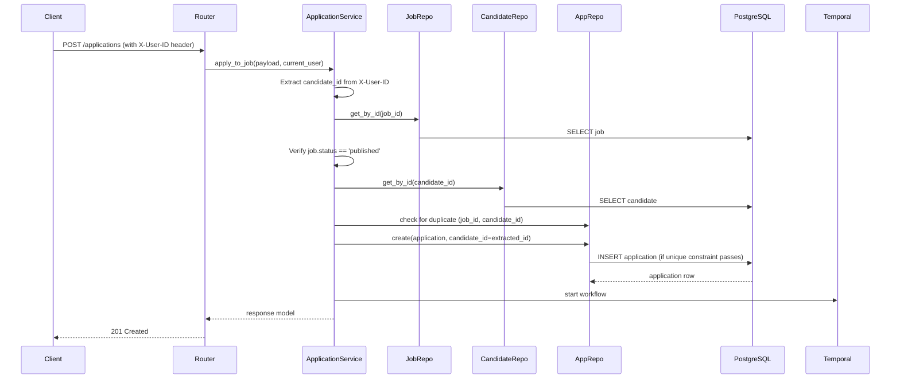
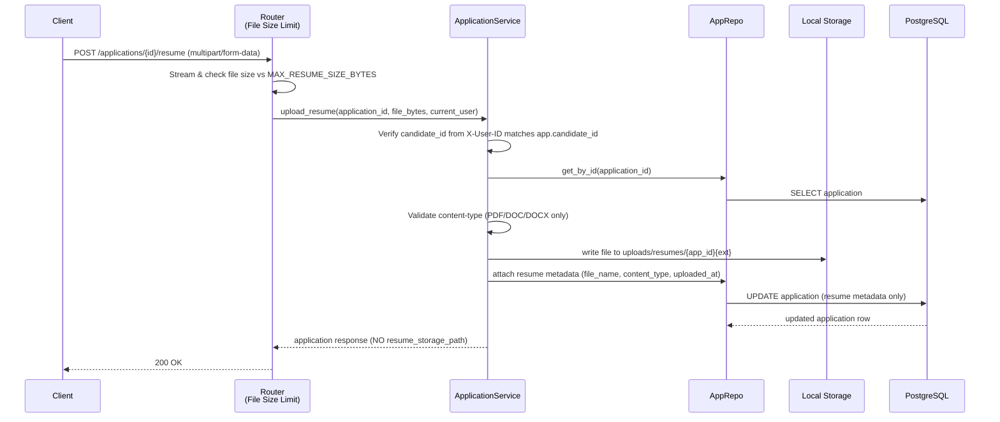

# Services: Business Logic Layer

## Overview

Services own business behavior. Routers should stay thin, repositories should stay data-focused, and services should coordinate validation, persistence, workflows, and events.

## Service Interaction Diagram



## Core Service Responsibilities

### RecruiterService

- Create and fetch recruiter profiles.
- Enforce unique recruiter identity rules before persistence.

### CandidateService

- Create and fetch candidate records.
- Update and delete the authenticated candidate's own profile.
- Prevent duplicate candidate emails during create and update flows.
- Keep candidate profiles independent from application-specific resume variants.

### JobService

- Create draft jobs (status always `draft`, recruiter_id from auth context)
- Update jobs (PATCH) with authorization checks (only job owner can update)
- Delete jobs (only job owner can delete)
- Start publishing workflows.
- Emit job lifecycle events.
- Enforce recruiter ownership and status transition rules.

### ApplicationService

- Bind application creation to authenticated candidate (from X-User-ID header)
- Validate job exists and is in `published` status
- Prevent duplicate applications (unique constraint on job_id, candidate_id)
- Create application records with server-set candidate_id
- Handle resume uploads with file-size and content-type validation
- Authorize access: candidates see only their own apps, recruiters see apps for their jobs
- Start downstream scoring or notification workflows

## Job Creation Flow



## Application Submission Flow



**Key changes:**

- `candidate_id` comes from auth context (`X-User-ID`), not request body
- Job must be `published` before allowing applications
- Database unique constraint `(job_id, candidate_id)` prevents duplicates at DB level

## Resume Upload Flow



**Key changes:**

- Router pre-checks file size before streaming to service (prevents OOM)
- Service verifies the authenticated candidate owns the application
- Internal `resume_storage_path` is **not** included in API response

## Service Design Rules

1. **Raise domain exceptions, not HTTP exceptions.** Services should raise `NotFoundError`, `ForbiddenError`, `BadRequestError`, `ConflictError` from `app.services.exceptions`. Routers and FastAPI exception handlers convert these to HTTP responses (404, 403, 400, 409, etc.). This decouples services from HTTP and enables them to be called from workflows, background tasks, or other non-HTTP contexts.

2. **Bind ownership to auth context, not request bodies.** When creating jobs, use `current_user.id` (X-User-ID header) as the recruiter; similarly bind candidate applications to the authenticated candidate's UUID. This prevents authorization bypasses.

3. **Enforce server-controlled status transitions.** Job `status` is never accepted from the request body on creation; it always defaults to `draft`. Status changes happen via explicit `PATCH /jobs/{id}` with scoped authorization checks.

4. **Validate eligibility early.** Before creating an application, check that the job exists, is in `published` status, and that no duplicate application exists. Prevent applications to draft/closed jobs.

5. **Keep SQL construction in repositories, pagination in the database.** Repositories should compose `.limit()` and `.offset()` into queries, not return all records for Python-level slicing.

6. **Use services for orchestration and business decisions.** Return schema-friendly domain objects or response models. Prefer database constraints for hard integrity rules (unique constraints, foreign keys) and service validation for policy rules (authorization, status checks).

## Error Handling

Services raise domain exceptions from `app.services.exceptions`:

| Exception              | HTTP Code | Scenario                                              |
| ---------------------- | --------- | ----------------------------------------------------- |
| `BadRequestError`      | 400       | Invalid input, missing required fields, wrong status  |
| `ForbiddenError`       | 403       | Authorization denied (wrong role, not resource owner) |
| `NotFoundError`        | 404       | Resource doesn't exist                                |
| `ConflictError`        | 409       | Duplicate application, duplicate email                |
| `PayloadTooLargeError` | 413       | Resume file exceeds max size                          |

**Conversion pattern:**

Routers and the FastAPI exception handlers in `app.main` convert these to JSON responses:

```python
@app.exception_handler(ForbiddenError)
async def handle_forbidden(_: object, exc: ForbiddenError) -> JSONResponse:
    return JSONResponse(status_code=403, content={"detail": str(exc)})
```

## Related Documentation

- [Architecture](ARCHITECTURE.md)
- [Database Design](DATABASE.md)
- [Setup Guide](SETUP.md)
