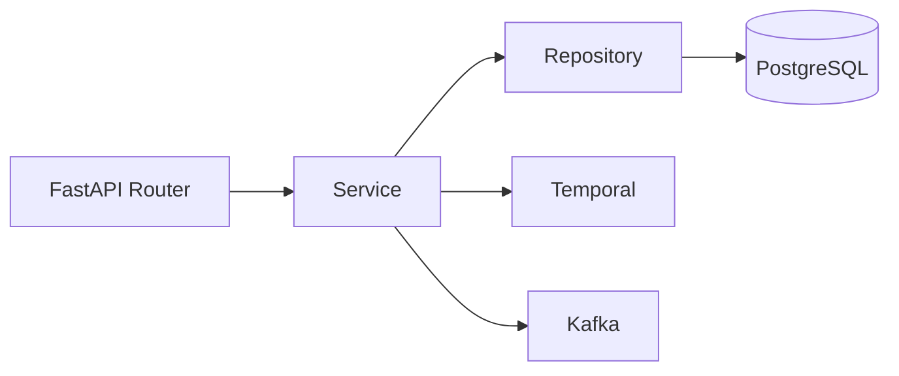
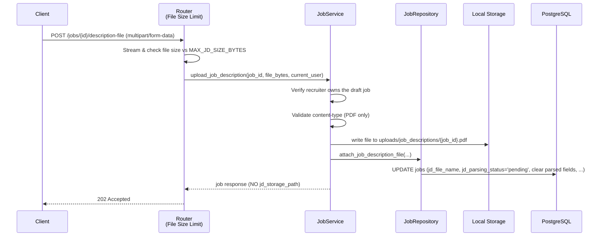
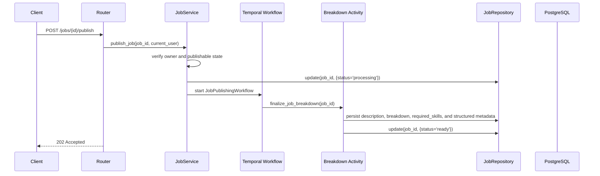
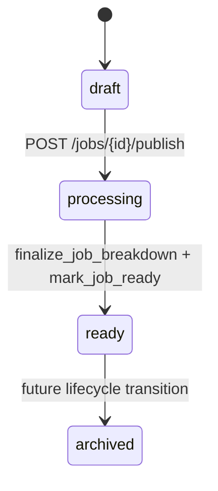
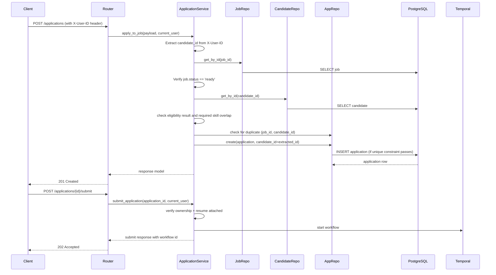
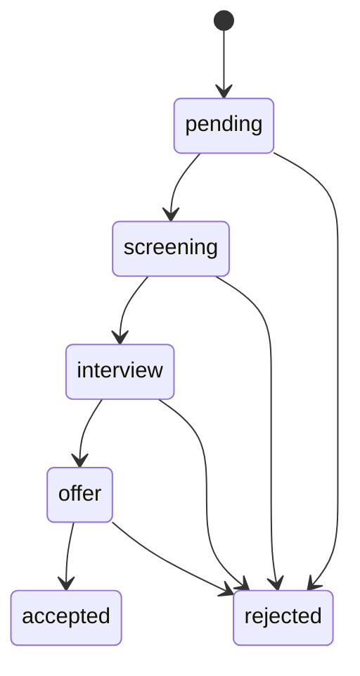
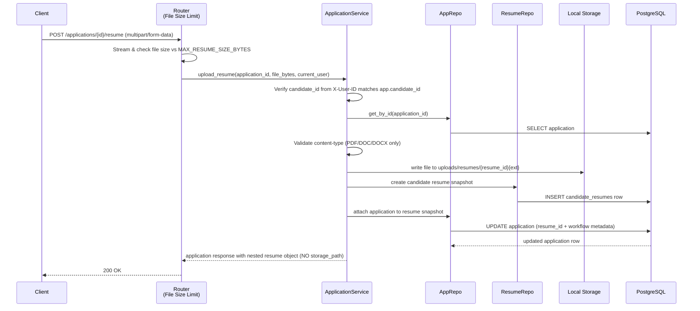

# Services: Business Logic Layer

## Overview

Services own business behavior. Routers should stay thin, repositories should stay data-focused, and services should coordinate validation, persistence, workflows, and events.

## Service Interaction Diagram



## Core Service Responsibilities

### RecruiterService

- Create and fetch recruiter profiles.
- Enforce unique recruiter identity rules before persistence.

### CandidateService

- Create and fetch candidate records.
- Update and delete the authenticated candidate's own profile.
- Prevent duplicate candidate emails during create and update flows.
- Keep candidate profiles independent from application-specific resume variants.

### JobService

- Create draft jobs (status always `draft`, recruiter_id from auth context)
- Accept manual description content as a fallback while PDF parsing is pending
- Accept optional structured metadata overrides for employment type, seniority, location, compensation, experience, and deadlines
- Upload recruiter-provided JD PDFs and persist parsing lifecycle metadata
- Update jobs (PATCH) with authorization checks (only job owner can update)
- Delete jobs (only job owner can delete)
- Enforce recruiter ownership and status transition rules
- Support JD parsing lifecycle and normalize parsed metadata into first-class job columns

### ApplicationService

- Bind application creation to authenticated candidate (from X-User-ID header)
- Validate job exists and is in `ready` status
- Use `EligibilityService` to enforce a minimum skills match before application creation
- Prevent duplicate applications (unique constraint on job_id, candidate_id)
- Create application records with server-set candidate_id
- Require candidate-owned resume upload before final submission
- Submit candidate applications explicitly through a dedicated endpoint
- Resolve recruiter access through the job owner relationship instead of storing a duplicate recruiter FK on applications
- Handle resume uploads with file-size and content-type validation
- Authorize access: candidates see only their own apps, recruiters see apps for their jobs
- Initialize application workflow metadata and start the Temporal workflow only after submit
- Single unified workflow handles both application initialization and resume parsing (if resume exists at submit time)

### AnalyticsService

- Serve the analytics API through query-backed reads.
- Aggregate the required metrics directly from transactional tables.
- Count durable failure signals from job workflows, application workflows, event-processing records, and outbox publishing records.
- Keep reporting read-only; do not introduce a separate analytics store or projection pipeline.

### EligibilityService

- Confirms that the target job exists and is in `ready` status.
- Rejects duplicate applications before create.
- Evaluates candidate eligibility based on resume parsing at scoring time.
- Application scoring uses resume skills only (parsed from the uploaded resume file).
- Applications with resume match score ≤ 0.5 are automatically rejected; scores > 0.5 proceed to screening.

## Event and Worker Responsibilities

- `JobService` and `ApplicationService` persist their state changes before writing transactional outbox records.
- The outbox relay publishes durable domain events without coupling API success to Kafka availability.
- Kafka consumers stay thin and dispatch idempotent Celery tasks for analytics, notifications, and scoring.
- `AnalyticsService` exposes the reporting surface after those durable writes and task outcomes are persisted.

## Job Creation Flow


## Job Description Upload Flow



## Job Publishing Workflow





## Application Submission Flow



**Key changes:**

- `candidate_id` comes from auth context (`X-User-ID`), not request body
- Job must be `ready` before allowing applications
- Database unique constraint `(job_id, candidate_id)` prevents duplicates at DB level
- Resume upload and submission are separated: candidates prepare data first, then explicitly submit
- Recruiters can move application status only after the candidate has submitted the application



## Resume Upload Flow



**Key changes:**

- Router pre-checks file size before streaming to service (prevents OOM)
- Service verifies the authenticated candidate owns the application
- Parsed resume content and file metadata live on the candidate resume snapshot, not on the application row
- Internal `storage_path` is **not** included in API response

## Service Design Rules

1. **Raise domain exceptions, not HTTP exceptions.** Services should raise `NotFoundError`, `ForbiddenError`, `BadRequestError`, `ConflictError` from `app.services.exceptions`. Routers and FastAPI exception handlers convert these to HTTP responses (404, 403, 400, 409, etc.). This decouples services from HTTP and enables them to be called from workflows, background tasks, or other non-HTTP contexts.

2. **Bind ownership to auth context, not request bodies.** When creating jobs, use `current_user.id` (X-User-ID header) as the recruiter; similarly bind candidate applications to the authenticated candidate's UUID. This prevents authorization bypasses.

3. **Enforce server-controlled status transitions.** Job `status` is never accepted from the request body on creation; it always defaults to `draft`. Publishing happens through `POST /jobs/{id}/publish`, and subsequent transitions follow the explicit state machine.

4. **Keep JD parsing lifecycle separate from publication lifecycle.** `jd_parsing_status` tracks content-ingestion progress, while `status` tracks recruiter-facing publication state. Services should not overload one field to represent both concerns.

5. **Validate eligibility early.** Before creating an application, check that the job exists, is in `ready` status, and that no duplicate application exists. Prevent applications to draft/processing/archived jobs.

6. **Keep SQL construction in repositories, pagination in the database.** Repositories should compose `.limit()` and `.offset()` into queries, not return all records for Python-level slicing.

7. **Use services for orchestration and business decisions.** Return schema-friendly domain objects or response models. Prefer database constraints for hard integrity rules (unique constraints, foreign keys) and service validation for policy rules (authorization, status checks).

## Error Handling

Services raise domain exceptions from `app.services.exceptions`:

| Exception              | HTTP Code | Scenario                                              |
| ---------------------- | --------- | ----------------------------------------------------- |
| `BadRequestError`      | 400       | Invalid input, missing required fields, wrong status  |
| `ForbiddenError`       | 403       | Authorization denied (wrong role, not resource owner) |
| `NotFoundError`        | 404       | Resource doesn't exist                                |
| `ConflictError`        | 409       | Duplicate application, duplicate email                |
| `PayloadTooLargeError` | 413       | Resume or JD file exceeds max size                    |

**Conversion pattern:**

Routers and the FastAPI exception handlers in `app.main` convert these to JSON responses:

```python
@app.exception_handler(ForbiddenError)
async def handle_forbidden(_: object, exc: ForbiddenError) -> JSONResponse:
    return JSONResponse(status_code=403, content={"detail": str(exc)})
```

## Related Documentation

- [Architecture](ARCHITECTURE.md)
- [Database Design](DATABASE.md)
- [Setup Guide](SETUP.md)
