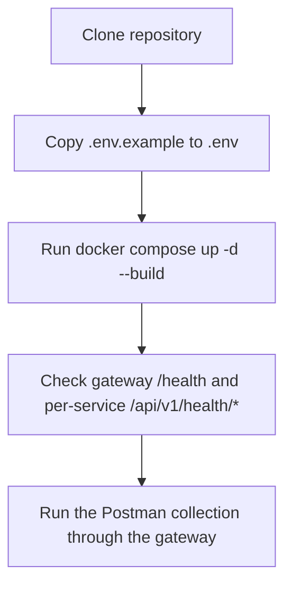

# Setup: Installation and Local Development

## Environment Files

A single tracked template lives at the repo root:

- `.env.example`

Copy it to `.env` (untracked) and fill in real values before starting the stack. It configures Postgres, the Nginx gateway port, Temporal, and every service's `DATABASE_URL`, upload directories, and business limits.

## Setup Flow



## Quick Start

```bash
cp .env.example .env
docker compose up -d --build
```

Each service's `Dockerfile` builds with the repo root as its context and installs `shared`/`contracts` directly from their source directories (no separate build step, no vendored wheel):

- `shared` (infra toolkit: `auth`, `db`, `exceptions`, `http_client`, `temporal`, etc.) — installed into all 5 services.
- `contracts` (cross-service wire-format enums and response shapes) — installed only into `user`, `job`, `resume`, and `application`, since `notification` doesn't import it.

Because the install happens straight from source at build time, `docker compose build <service>` always picks up the latest `shared`/`contracts` code — there's no separate step to remember or forget.

Every service's `Dockerfile` runs `alembic upgrade head` before starting `uvicorn`, so no manual migration step is needed for a fresh stack.

## Local Services

| Service                              | Host Port         | Purpose                                          |
| ------------------------------------- | ------------------ | ------------------------------------------------- |
| `nginx` (gateway)                    | `${NGINX_PORT}` (80) | Primary entrypoint, routes `/api/v1/<resource>/*` to the owning service |
| `user-service`                       | `8001`             | Recruiter + Candidate CRUD                         |
| `job-service` + `job-service-worker` | `8003`             | Job CRUD + `JobPublishingWorkflow` (Temporal)      |
| `resume-service` + `resume-service-worker` | `8004`       | Resume upload + `ResumeParsingWorkflow` (Temporal) |
| `application-service`                | `8005`             | Application workflow, calls job/candidate/resume services over HTTP |
| `notification-service`               | `8006`             | Week 3 stub — health endpoint only                |
| `postgres`                           | `5432`             | One container, five logical databases (see below) |
| `temporal`                           | `7233` (gRPC), `8233` | Temporal server                               |
| `temporal-ui`                        | `${TEMPORAL_UI_PORT}` (8080) | Workflow inspection UI                  |

Every service publishes its own host port so its Swagger UI (`http://localhost:<port>/docs`) is directly reachable for interactive schema inspection — that's a local-dev convenience only. Real API requests should go through the gateway at `http://localhost/api/v1/...` so routing and auth-header forwarding match what a real client would see; nginx doesn't proxy `/docs`, so Swagger itself isn't reachable through the gateway.

## Local Service Run (Without Docker)

The shared venv lives at the repo root (`.venv/`) so it can be used across every `services/*/` package.

```bash
python -m venv .venv
.\.venv\Scripts\Activate.ps1   # macOS/Linux: source .venv/bin/activate
pip install -r services/<name>/requirements.txt
pip install -e ./shared
pip install -e ./contracts     # only needed for user, job, resume, application — not notification
cd services/<name>
cp .env.example .env           # if the service has one; otherwise set env vars directly
alembic upgrade head
uvicorn app.main:app --reload --host 0.0.0.0 --port <service-port>
```

`pip install -e ./shared` and `pip install -e ./contracts` install `smarthire-shared` and `smarthire-contracts` in editable mode into the shared venv, so `auth`, `db`, `exceptions`, `contracts`, and the rest of their top-level packages are importable exactly as they are inside the containers, and local edits take effect immediately without reinstalling.

When running outside Docker, point `DATABASE_URL` at `localhost` instead of the `postgres` hostname used inside the compose network.

## Configuration

Key root `.env` variables (see `.env.example` for the full list):

| Variable                       | Default        | Purpose                                    |
| ------------------------------- | -------------- | ------------------------------------------- |
| `POSTGRES_DB`                  | `smarthire`    | Default admin DB (per-service DBs are separate) |
| `POSTGRES_HOST_PORT`           | `5432`         | Host-side Postgres port                    |
| `NGINX_PORT`                   | `80`           | Gateway host port                          |
| `TEMPORAL_UI_PORT`             | `8080`         | Temporal UI host port                      |
| `USER_DATABASE_URL`            | —              | asyncpg URL for `user_db`                  |
| `JOB_DATABASE_URL`             | —              | asyncpg URL for `job_db`                   |
| `RESUME_DATABASE_URL`          | —              | asyncpg URL for `resume_db`                |
| `APPLICATION_DATABASE_URL`     | —              | asyncpg URL for `application_db`           |
| `RESUME_UPLOAD_DIR`            | `uploads/resumes` | Resume storage path inside resume-service |
| `MAX_RESUME_SIZE_BYTES`        | `10485760` (10 MB) | Max resume file size                   |
| `JD_UPLOAD_DIR`                | `uploads/job_descriptions` | JD storage path inside job-service |
| `MAX_JD_SIZE_BYTES`            | `10485760` (10 MB) | Max JD file size                       |
| `MAX_APPLICATIONS_PER_CANDIDATE` | `5`          | Active application cap per candidate        |
| `HTTP_CLIENT_TIMEOUT_SECONDS`  | `5.0`          | Timeout for application-service's HTTP calls to job/candidate/resume services |

Uploaded files are written to each service container's local filesystem, backed by named Docker volumes (`job_uploads`, `resume_uploads`) shared with each service's Temporal worker, so uploads persist across container recreates. That's acceptable for local validation; a real deployment would back this with object storage instead of a local volume.

## Docker Compose Run

```bash
docker compose up -d --build
docker compose logs -f job-service
docker compose logs -f job-service-worker
docker compose logs -f resume-service-worker
```

`docker-compose.yml` at the repo root is the only compose entrypoint — there's no separate per-service compose file. Each service's `Dockerfile` installs `shared`/`contracts` directly from source at build time, so a change to `shared/` or `contracts/` takes effect on the next `docker compose build <service>` — it does not take effect on a plain container restart, since the code is baked into the image rather than bind-mounted.

## Migration Workflow

Each service owns its own Alembic setup:

```bash
cd services/<name>
alembic revision --autogenerate -m "describe change"
alembic upgrade head
```

Migrations run automatically inside each service's container on startup (`Dockerfile` `CMD`), so this is mainly needed when developing a service locally or generating a new revision.

## Verification

```bash
# Gateway liveness (nginx itself, no backend dependency)
curl http://localhost/health

# Per-service deep health (DB connectivity check)
curl http://localhost/api/v1/health/user
curl http://localhost/api/v1/health/job
curl http://localhost/api/v1/health/resume
curl http://localhost/api/v1/health/application
curl http://localhost/api/v1/health/notification
```

Expected gateway response:

```json
{ "status": "ok", "service": "gateway" }
```

Expected per-service response (user/job/resume/application):

```json
{ "status": "ok", "database": "up" }
```

## Manual API Testing

Use one of these entry points:

- **Postman collection**: `postman/SmartHire.postman_collection.json` — the primary validation path; every request routes through the gateway at `{{baseUrl}} = http://localhost/api/v1`.
- **Temporal UI**: `http://localhost:8080` — inspect `JobPublishingWorkflow` and `ResumeParsingWorkflow` executions.
- **Per-service Swagger/ReDoc**: `http://localhost:<port>/docs` (see the Local Services table above) — handy for schema inspection, but not routed through the gateway.

Required mock auth headers for most requests:

- `X-User-ID`
- `X-User-Role` with value `RECRUITER` or `CANDIDATE`

Recommended validation order (matches the Postman collection's smoke test):

1. **Create a recruiter** (role: RECRUITER)

   ```
   POST /api/v1/recruiters
   {"email": "recruiter@test.com", "name": "Alice"}
   ```

   Save the returned `id` as `recruiterId` — use it as `X-User-ID` for all subsequent recruiter-scoped calls.

2. **Create a candidate** (role: CANDIDATE)

   ```
   POST /api/v1/candidates
   {"email": "candidate@test.com", "name": "Bob", "master_profile_data": {"skills": ["python"]}}
   ```

   Save the returned `id` as `candidateId`.

3. **Create a job** (as recruiter with `X-User-ID=recruiterId`)

   ```
   POST /api/v1/jobs
   {"title": "Backend Engineer", "description": "...", "required_skills": ["python"]}
   ```

   `recruiter_id` is bound to `X-User-ID` and `status` defaults to `draft`; neither can be set in the request body. Save the returned `id` as `jobId`.

4. **Publish the job** (as recruiter — triggers `JobPublishingWorkflow` in job-service-worker)

   ```
   POST /api/v1/jobs/{jobId}/publish
   ```

   Returns `202` with a `workflow_id` and `status` of `processing`. Poll `GET /api/v1/jobs/{jobId}` until `status` becomes `ready` — only ready jobs accept applications.

5. **Upload a resume** (as candidate — independent of any application, handled entirely by resume-service)

   ```
   POST /api/v1/resumes
   multipart/form-data with field 'resume' containing a PDF file
   ```

   Parsing runs asynchronously via `ResumeParsingWorkflow` (resume-service-worker); `parsing_status` starts as `pending`.

6. **Create an application** (as candidate with `X-User-ID=candidateId`)

   ```
   POST /api/v1/applications
   {"job_id": "{{jobId}}"}
   ```

   `candidate_id` is bound to `X-User-ID`. application-service calls job-service, user-service, and resume-service over HTTP to check eligibility (job must be `ready`, skills must match) before persisting.

7. **Verify duplicate rejection** (as candidate)

   ```
   POST /api/v1/applications
   {"job_id": "{{jobId}}"}
   ```

   Returns `409 Conflict`.

8. **Retrieve the application** (as candidate)

   ```
   GET /api/v1/applications/{applicationId}
   ```

   Response includes `resume_id` (nullable — only set when eligibility fell back to a parsed resume) and `eligibility_result`.

9. **Transition the application** (as recruiter)

   ```
   PATCH /api/v1/applications/{applicationId}/status
   {"status": "screening"}
   ```

## Authorization & Auth Headers

Most endpoints require two headers:

- `X-User-ID`: UUID of the authenticated user
- `X-User-Role`: One of `RECRUITER` or `CANDIDATE`

**Access Scoping:**

- **Recruiters** can create/read jobs, publish jobs, and transition applications for jobs they own. They cannot create applications, upload resumes, or modify candidate profiles.
- **Candidates** can create/read/update/delete their own profile, upload resumes, and create/read applications tied to their own `candidate_id`. They cannot create jobs or view other candidates' profiles.

Example recruiter request through the gateway:

```bash
curl -X POST http://localhost/api/v1/jobs \
  -H "X-User-ID: 11111111-1111-1111-1111-111111111111" \
  -H "X-User-Role: RECRUITER" \
  -H "Content-Type: application/json" \
  -d '{"title": "...", "description": "...", "required_skills": ["python"]}'
```

Example candidate request:

```bash
curl -X POST http://localhost/api/v1/applications \
  -H "X-User-ID: 22222222-2222-2222-2222-222222222222" \
  -H "X-User-Role: CANDIDATE" \
  -H "Content-Type: application/json" \
  -d '{"job_id": "..."}'
```

## Troubleshooting

### Database connection fails

- Confirm `smarthire-postgres` is running and healthy: `docker compose ps postgres`.
- Confirm each service's `*_DATABASE_URL` in `.env` uses the `postgres` hostname (compose network) — use `localhost` only for a service run outside Docker.
- `infra/postgres/init.sql` creates the five logical databases (`user_db`, `job_db`, `resume_db`, `application_db`, `notification_db`) on first container start only; if you need to recreate them, remove the `postgres_data` volume and restart (destructive — confirm before doing this).

### A service returns 404 through the gateway but works when hit directly

- Check `infra/nginx/nginx.conf` — each resource needs both an exact-match location (bare collection path, e.g. `= /api/v1/jobs`) and a prefix location (`/api/v1/jobs/`) to avoid nginx's automatic trailing-slash redirect colliding with FastAPI's own slash redirect.

### Alembic import fails

- Activate the root `.venv`.
- Install dependencies from the specific service's `requirements.txt` (`services/<name>/requirements.txt`), not a shared one.
- Ensure `smarthire-shared` and (for user/job/resume/application) `smarthire-contracts` are installed into the venv (`pip install -e ./shared` / `pip install -e ./contracts`) when running a service outside Docker.

### Resume upload fails

- Confirm `python-multipart` is installed (it's in every service's `requirements.txt` that accepts uploads).
- Confirm the request uses `multipart/form-data` with field name `resume`, targeting `POST /api/v1/resumes` (not an application sub-path).

### JD upload fails

- Confirm the request uses `multipart/form-data` with field name `description_file`.
- Confirm the file is a PDF and does not exceed `MAX_JD_SIZE_BYTES`.
- Confirm the target job is still in `draft` status and owned by the authenticated recruiter.

## Related Documentation

- [Architecture](ARCHITECTURE.md)
- [Database Design](DATABASE.md)
- [Service Layer](SERVICES.md)
