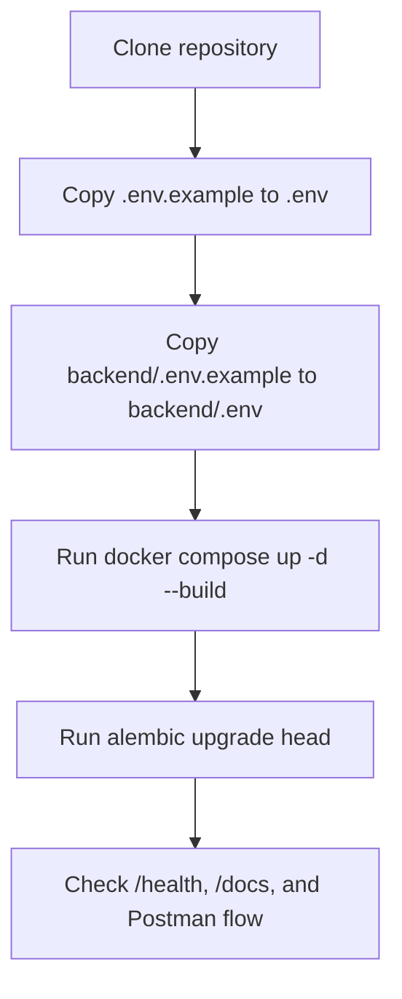

# Setup: Installation and Local Development

## Environment Files

Tracked templates live here:

- `.env.example`
- `backend/.env.example`

Real `.env` files remain untracked and should stay local.

## Setup Flow



## Quick Start

```bash
cp .env.example .env
cp backend/.env.example backend/.env
docker compose up -d --build
cd backend
alembic upgrade head
```

## Local Services

| Service         | Default Port | Purpose                     |
| --------------- | ------------ | --------------------------- |
| FastAPI backend | 8000         | HTTP API and Swagger        |
| PostgreSQL      | 5432         | Primary relational database |

## Backend Local Run

```bash
cd backend
.\.venv\Scripts\Activate.ps1
pip install -r requirements.txt
uvicorn app.main:app --reload --host 0.0.0.0 --port 8000
```

## Configuration

**Backend environment variables** (in `backend/.env`):

| Variable                      | Default                      | Purpose                       |
| ----------------------------- | ---------------------------- | ----------------------------- |
| `DATABASE_URL`                | (required)                   | PostgreSQL connection string  |
| `KAFKA_BOOTSTRAP_SERVERS`     | `localhost:29092`            | Local Kafka bootstrap address |
| `SCHEMA_REGISTRY_URL`         | `http://localhost:8081`      | Local schema registry URL     |
| `RABBITMQ_URL`                | `amqp://...@localhost:5672/` | Local RabbitMQ broker URL     |
| `REDIS_URL`                   | `redis://localhost:6379/0`   | Local Redis URL               |
| `CELERY_BROKER_URL`           | `amqp://...@localhost:5672/` | Celery broker URL             |
| `CELERY_RESULT_BACKEND`       | `redis://localhost:6379/0`   | Celery result backend         |
| `LOG_LEVEL`                   | `INFO`                       | Application log level         |
| `METRICS_ENABLED`             | `true`                       | Metrics toggle                |
| `TRACING_ENABLED`             | `false`                      | Tracing toggle                |
| `OTEL_EXPORTER_OTLP_ENDPOINT` | `http://localhost:4317`      | OTLP collector endpoint       |
| `APP_ENV`                     | `development`                | Environment mode              |
| `APP_HOST`                    | `0.0.0.0`                    | Bind address                  |
| `APP_PORT`                    | `8000`                       | HTTP port                     |
| `RESUME_UPLOAD_DIR`           | `uploads/resumes`            | Local resume storage path     |
| `MAX_RESUME_SIZE_BYTES`       | `10485760` (10 MB)           | Max resume file size in bytes |
| `JD_UPLOAD_DIR`               | `uploads/job_descriptions`   | Local JD storage path         |
| `MAX_JD_SIZE_BYTES`           | `10485760` (10 MB)           | Max JD file size in bytes     |
| `PYTHONDONTWRITEBYTECODE`     | `1`                          | Suppress .pyc files           |
| `PYTHONUNBUFFERED`            | `1`                          | Unbuffered output             |

Override any variable in `backend/.env` to change behavior.

The root `.env` is the Docker env file for Compose and container-to-container settings. The backend app and host-side Alembic commands load `backend/.env`.

For Docker-backed processes, the backend, Temporal worker, and event relay now load the root `.env` through Compose `env_file` entries anchored to the compose file location. This prevents `docker compose` runs from accidentally picking up `backend/.env` values such as `localhost` Kafka or Postgres endpoints.

## Docker Compose Run

```bash
docker compose up -d --build
docker compose logs -f backend
```

Run Docker Compose from the repo root when possible. If you run it from another directory, prefer an explicit command such as:

```bash
docker compose --project-directory .. -f ../docker-compose.yml up -d --build
```

The root [docker-compose.yml](docker-compose.yml) remains the local development entrypoint. Canonical backend Docker assets now live under `backend/infra/docker/`, including separate `Dockerfile.dev` and `Dockerfile.prod` variants plus `backend/infra/docker/compose.prod.yml` for a production-style compose run.

## Migration Workflow

```bash
cd backend
alembic upgrade head
alembic revision --autogenerate -m "describe change"
```

## Verification

```bash
curl http://localhost:8000/health
```

Expected response:

```json
{ "status": "ok", "database": "up" }
```

## Manual API Testing

Use one of these entry points:

- Swagger UI: `http://localhost:8000/docs`
- ReDoc: `http://localhost:8000/redoc`
- Postman collection: `backend/postman/SmartHire.postman_collection.json`

Required mock auth headers for most requests:

- `X-User-ID`
- `X-User-Role` with value `RECRUITER` or `CANDIDATE`

Recommended Day 5 validation order:

1. **Create a recruiter** (role: RECRUITER)

   ```
   POST /recruiters
   {"email": "recruiter@test.com", "name": "Alice"}
   ```

   Save the returned `id` as `recruiterId`.

2. **Create a candidate** (role: CANDIDATE)

   ```
   POST /candidates
   {"email": "candidate@test.com", "name": "Bob"}
   ```

   Save the returned `id` as `candidateId`.

3. **Create a job** (as recruiter with X-User-ID=recruiterId)

   ```
   POST /jobs
   {"title": "Backend Engineer", "description": "Interim manual markdown while PDF parsing is pending.", "employment_type": "full_time", "seniority_level": "senior", "location": {"city": "Lahore", "country": "Pakistan", "remote_policy": "hybrid"}, "years_of_experience_required": 5, "required_skills": ["python"]}
   ```

   Note: `recruiter_id` is automatically bound to X-User-ID (cannot be overridden)  
   Note: `status` defaults to `draft` (cannot be set in request body)  
   Note: manual `description` is parsed immediately and can populate `description_breakdown` plus normalized metadata fields  
   Save the returned `id` as `jobId`.

4. **Upload a JD PDF** (as recruiter)

   ```
   POST /jobs/{jobId}/description-file
   multipart/form-data with field 'description_file' containing a PDF file
   ```

   The API stores the file and updates `jd_parsing_status` to `pending`. Parsed fields are populated when the publish workflow runs.

5. **Publish the job** (as recruiter, trigger the Temporal workflow)

   ```
   POST /jobs/{jobId}/publish
   ```

   Only ready jobs can receive applications. Publishing moves the job to `processing`, runs JD finalization, and marks the job `ready` on success.

6. **Create an application** (as candidate with X-User-ID=candidateId)

   ```
   POST /applications
   {"job_id": "{{jobId}}"}
   ```

   Note: `candidate_id` is automatically bound to X-User-ID (cannot be overridden)  
   Note: Application fails if job is not ready.
   Save the returned `id` as `applicationId`.

7. **Upload a resume** (as candidate)

   ```
   POST /applications/{applicationId}/resume
   multipart/form-data with field 'resume' containing a PDF/DOC/DOCX file
   ```

   File is stored locally; metadata (filename, content_type, uploaded_at) appears in the application response.

8. **Verify duplicate rejection** (as candidate)

   ```
   POST /applications
   {"job_id": "{{jobId}}"}
   ```

   Should return `409 Conflict`: "Candidate already applied to this job"

9. **Retrieve the application** (as candidate)
   ```
   GET /applications/{applicationId}
   ```
   Confirm the nested `resume` object is present with file metadata and parsing status (but NOT `storage_path`, which is internal).

## Authorization & Auth Headers

Most endpoints require two headers:

- `X-User-ID`: UUID or unique identifier of the authenticated user
- `X-User-Role`: One of `RECRUITER` or `CANDIDATE`

**Access Scoping:**

- **Recruiters** can:
  - Create/read/update/delete their own jobs
  - View applications for their jobs
  - Cannot create applications, upload resumes, or modify candidate profiles

- **Candidates** can:
  - Create/read/update/delete their own profiles
  - View and apply to ready jobs
  - Upload resumes to their own applications
  - View only their own applications
  - Cannot create jobs or view other candidates' profiles

Example recruiter request:

```bash
curl -X POST http://localhost:8000/jobs \
  -H "X-User-ID: 11111111-1111-1111-1111-111111111111" \
  -H "X-User-Role: RECRUITER" \
  -H "Content-Type: application/json" \
  -d '{"title": "...", "description": "..."}'
```

Example candidate request:

```bash
curl -X POST http://localhost:8000/applications \
  -H "X-User-ID: 22222222-2222-2222-2222-222222222222" \
  -H "X-User-Role: CANDIDATE" \
  -H "Content-Type: application/json" \
  -d '{"job_id": "...'}'
```

## Troubleshooting

### Database connection fails

- Confirm `smarthire-postgres` is running.
- Confirm `DATABASE_URL` points to `localhost` for local backend runs and `postgres` for compose-based runs.
- Re-run `alembic upgrade head` after the database is healthy.

### Alembic import fails

- Activate `backend/.venv`.
- Install dependencies from `backend/requirements.txt`.
- Keep `backend/alembic.ini` free of real connection strings; runtime settings are loaded from environment.

### Resume upload fails

- Confirm `python-multipart` is installed from `backend/requirements.txt`.
- Confirm the upload directory exists or that the backend process can create it.
- Confirm the request uses `multipart/form-data` with the field name `resume`.

### JD upload fails

- Confirm the request uses `multipart/form-data` with the field name `description_file`.
- Confirm the file is a PDF and does not exceed `MAX_JD_SIZE_BYTES`.
- Confirm the target job is still in `draft` status and is owned by the authenticated recruiter.

## Related Documentation

- [Architecture](ARCHITECTURE.md)
- [Database Design](DATABASE.md)
- [Service Layer](SERVICES.md)
