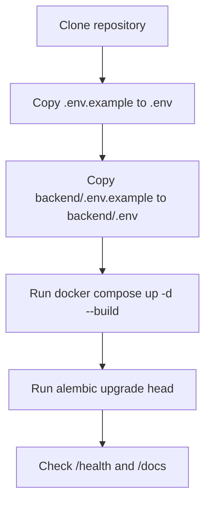

# Setup: Installation and Local Development

## Environment Files

Tracked templates live here:

- `.env.example`
- `backend/.env.example`

Real `.env` files remain untracked and should stay local.

## Setup Flow



## Quick Start

```bash
cp .env.example .env
cp backend/.env.example backend/.env
docker compose up -d --build
cd backend
alembic upgrade head
```

## Local Services

| Service         | Default Port | Purpose                     |
| --------------- | ------------ | --------------------------- |
| FastAPI backend | 8000         | HTTP API and Swagger        |
| PostgreSQL      | 5432         | Primary relational database |

## Backend Local Run

```bash
cd backend
.\.venv\Scripts\Activate.ps1
pip install -r requirements.txt
uvicorn app.main:app --reload --host 0.0.0.0 --port 8000
```

## Docker Compose Run

```bash
docker compose up -d --build
docker compose logs -f backend
```

## Migration Workflow

```bash
cd backend
alembic upgrade head
alembic revision --autogenerate -m "describe change"
```

## Verification

```bash
curl http://localhost:8000/health
```

Expected response:

```json
{ "status": "ok", "database": "up" }
```

## Troubleshooting

### Database connection fails

- Confirm `smarthire-postgres` is running.
- Confirm `DATABASE_URL` points to `localhost` for local backend runs and `postgres` for compose-based runs.
- Re-run `alembic upgrade head` after the database is healthy.

### Alembic import fails

- Activate `backend/.venv`.
- Install dependencies from `backend/requirements.txt`.
- Keep `backend/alembic.ini` free of real connection strings; runtime settings are loaded from environment.

## Related Documentation

- [Architecture](ARCHITECTURE.md)
- [Database Design](DATABASE.md)
- [Service Layer](SERVICES.md)
